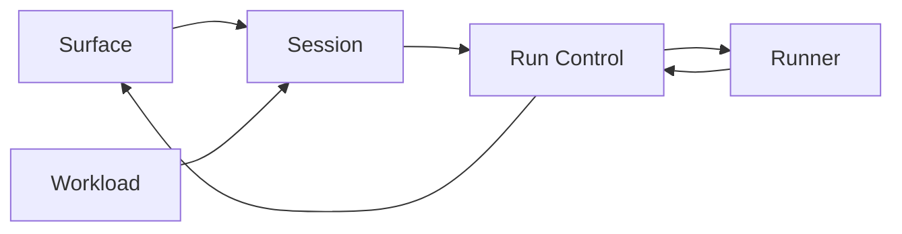
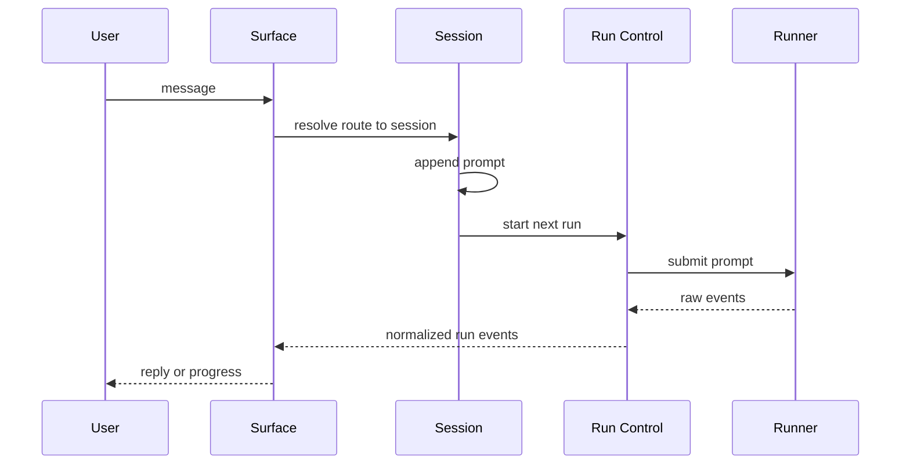
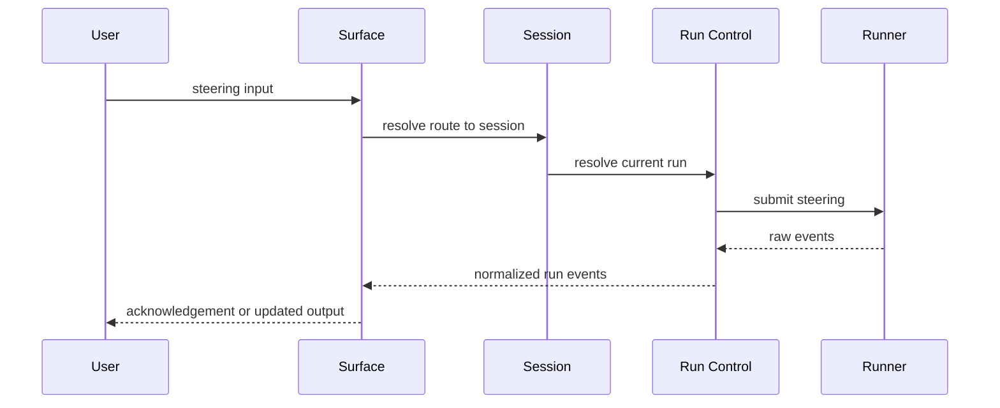

# Component Flows And Validation Loops

Source of truth:

- `docs/overview/human-requirements.md`
- `docs/architecture/v0.2/final-layered-architecture.md`

Question this file answers:

How do the layers talk without leaking ownership?

## Stable Communication Shape

## Boundary Rules

1. `Surface` resolves route and renders output, but does not decide session continuity or run state.
2. `Session` resolves conversation continuity and queue order, but does not speak raw runner protocol.
3. `Run Control` starts, steers, and settles active runs, but does not rewrite route or session identity.
4. `Runner` opens sessions, submits input, and emits raw facts, but does not decide queue or loop policy.
5. `Workload` schedules fresh work, but actual execution must re-enter through `Session`.

## Main Flows

| Flow | Path | Key reason |
| --- | --- | --- |
| Normal message | `Surface -> Session -> Run Control -> Runner -> Run Control -> Surface` | route, conversation, run, and executor stay separate |
| Steering | `Surface -> Session -> Run Control -> Runner -> Run Control -> Surface` | steering is active-run behavior, not route behavior |
| Session queue | `Session -> Run Control -> Runner -> Run Control -> Session` | session prompts stay sequential |
| New conversation | `Surface -> Session` | same `sessionKey`, new active `sessionId` |
| Session loop | `SessionLoop -> Session -> Run Control` | session-bound repeated work stays session-owned |
| Global loop | `GlobalLoop -> Workload -> Session -> Run Control` | global repeated work is not session-owned |
| Backlog item | `Backlog -> Workload -> Session -> Run Control -> Runner` | fresh-session work stays outside one active conversation until admitted |

## Core Sequence Diagrams

### Normal Message

Checks:

- `Surface` does not decide continuity
- `Session` does not speak runner protocol
- `Run Control` does not render by itself

### Steering

Checks:

- steering is run-owned
- queue bypass happens only through `Run Control`

## Short Flow Notes

| Flow | Required truth |
| --- | --- |
| Session queue | `SessionQueue` is session workflow, not a surface queue and not the tool's internal queue |
| New conversation | stable `sessionKey`, rotating active `sessionId`, historical links remain possible |
| Session loop | queue mode is default; direct steering from a loop must stay explicit |
| Global loop | admission pressure stays in `Workload` |
| Backlog item | must not jump straight into `Runner` |

## Raw Requirement Coverage

| Requirement | Covered by | Result |
| --- | --- | --- |
| Session vs `sessionId` linkage | normal message, new conversation | stable `sessionKey`, rotating `sessionId` |
| Chat surface distinct from session | normal message, steering, new conversation | route and conversation stay separate |
| Runner as executor abstraction | normal message, steering, global loop, backlog | tmux now, API or SDK later |
| Extra coordination objects only when justified | session loop, global loop, backlog | only `SessionQueue`, `SessionLoop`, `GlobalLoop`, `RunnerPool` survive |
| Run state machine | normal message, steering | run transitions stay in `Run Control` |
| Session queue is sequential workflow | session queue | one-by-one execution |
| Steering is direct injection | steering | bypass is explicit and run-owned |
| Backlog outside one session | backlog | fresh-session work has a separate home |
| Session-bound loop vs global loop | session loop, global loop | ownership stays clear |
| Runner pool caps concurrency | global loop, backlog | admission happens before fresh execution |

## Review Loop

Every pass on the design should repeat these questions:

1. Is this route truth, conversation truth, run truth, runner truth, or scheduling truth?
2. Can this path skip a layer and still remain truthful?
3. Is this session-bound work or fresh work?
4. If the same noun appears in two layers, which layer should lose it?
