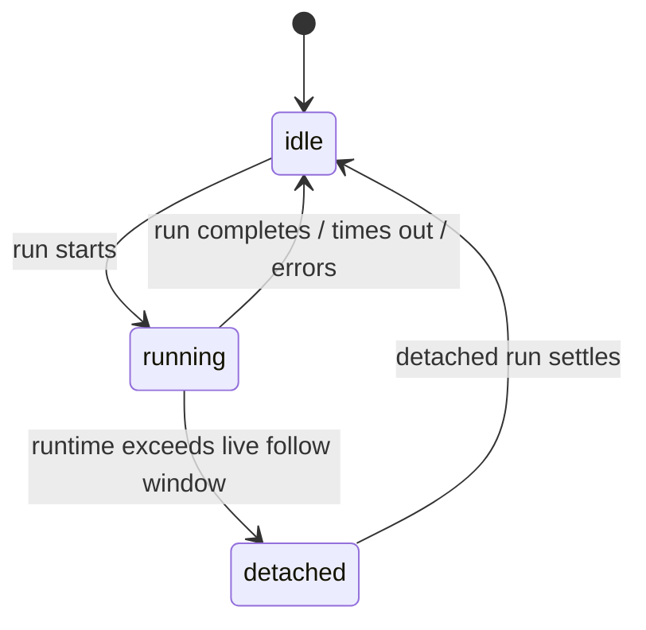
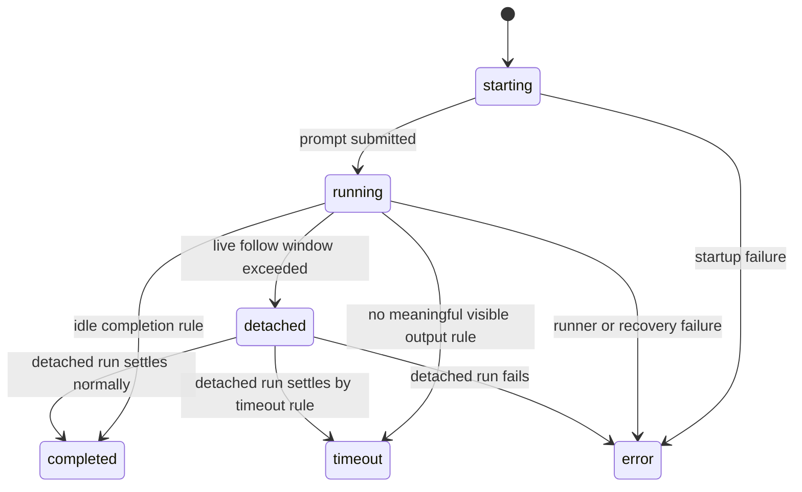

# State Machines

Source of truth:

- `docs/overview/human-requirements.md`
- `docs/architecture/v0.2/final-layered-architecture.md`
- `docs/architecture/v0.2/04-layer-function-contracts.md`

This file exists to make the state model MECE.

The main rule:

do not use one giant enum for queue state, session runtime state, and active run state.

## 1. Canonical State Families

There are three separate state families.

| State family | Owner | Purpose |
| --- | --- | --- |
| `SessionQueueState` | `Session` | whether a prompt is still waiting in session order |
| `SessionRuntimeState` | `Session` | whether the session currently has an active runtime projection |
| `RunState` | `Run Control` | what state the active run is in right now |

## 2. SessionQueueState

Canonical state:

- `queued`

Meaning:

- the prompt exists in `SessionQueue`
- it has not become an active run yet

Exit:

- once `Run Control` claims it, it leaves queue state and enters run state

Rule:

- `queued` is not a `RunState`
- `queued` does not change `SessionRuntimeState` by itself

## 3. SessionRuntimeState

Canonical states:

- `idle`
- `running`
- `detached`

Definitions:

| State | Meaning |
| --- | --- |
| `idle` | no active run is currently projected for this session |
| `running` | the session has an active run and clisbot is still in live follow mode |
| `detached` | the session still has an active run, but clisbot has left live follow mode and will only settle later |

State machine:

Rules:

- `detached` is still active, not terminal
- `detached` does not mean paused
- `idle` means no active runtime projection remains

Projection rule:

| Underlying active run view | SessionRuntimeState |
| --- | --- |
| no active run | `idle` |
| `RunState = starting` or `running` | `running` |
| `RunState = detached` | `detached` |
| terminal outcome written and run closed | `idle` |

## 4. RunState

Canonical states:

- `starting`
- `running`
- `detached`
- `completed`
- `timeout`
- `error`

Definitions:

| State | Meaning |
| --- | --- |
| `starting` | the run exists, but runner bootstrap or prompt submission is not confirmed yet |
| `running` | prompt submission is confirmed and the run is actively executing |
| `detached` | the run is still executing, but live follow has been left |
| `completed` | execution ended with a normal successful completion |
| `timeout` | execution produced no meaningful visible output within the configured timeout rule |
| `error` | execution ended because bootstrap, runner, or recovery failed |

State machine:

Categories:

| Category | States |
| --- | --- |
| active run states | `starting`, `running`, `detached` |
| terminal run states | `completed`, `timeout`, `error` |

Rules:

- `settled` is a category, not a state value
- `queued` is outside this state family
- `detached` is active, not terminal

Minimal transition set:

- `starting -> running`
- `starting -> error`
- `running -> detached`
- `running -> completed | timeout | error`
- `detached -> completed | timeout | error`

## 5. Validation Against Current Code

Current code already contains most of this split:

| Current code location | Current state family |
| --- | --- |
| `src/agents/run-observation.ts` | `SessionRuntimeState = idle | running | detached` |
| `src/agents/run-observation.ts` | `PromptExecutionStatus = running | completed | timeout | detached | error` |
| `src/shared/transcript-rendering.ts` | surface rendering adds `queued` for queue-facing messages |

Current mismatch worth naming:

- current implementation still folds `starting` into `running` plus note text like `Starting runner session...`
- current implementation exposes `PromptExecutionStatus`, not the full canonical split between queue state, runtime projection state, and active run state

Recommended direction:

- keep `starting` as a distinct architecture state even if the current code still renders it through `running + note`
- if code is later normalized, split that state explicitly instead of keeping startup hidden in note text

## 6. Review Checklist

When reviewing code or docs:

1. Is `queued` being treated as if it were an active run state?
2. Is `detached` being treated as terminal when it is still active?
3. Is `settled` being used as a literal persisted state instead of a category?
4. Is `starting` being hidden inside generic `running` behavior?
5. Are session-runtime states being mixed with run states?

If yes, the state model is leaking.
