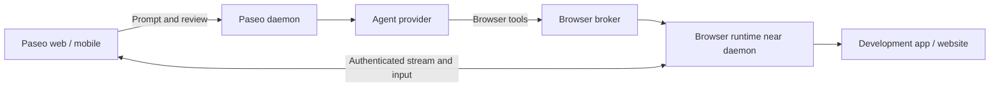

# Integrated Browser Research: Claude, Codex, T3 Code, and Paseo

## Working conclusion: four promising directions

The user provisionally selected the following directions for further investigation. This is a shortlist, not a final architecture choice or authorization to implement one.

1. **agent-browser with streaming.** Evaluate a browser runtime that agents can automate while web and mobile users watch and interact with the same session.
2. **Lightweight, open-source, full-screen remote desktop.** Start with Google/Chrome Remote Desktop as a usability and connection-setup reference, then compare alternatives. Investigate applications and extensions already providing similar remote viewing, control, and takeover for agent work sessions. Open-source status, self-hosting, resource consumption, and licensing must be verified per candidate; Chrome Remote Desktop is a reference, not an established match for those requirements.
3. **A convenient connection from the daemon to an external browser.** Make it easy to connect a browser outside the daemon process, potentially on a different machine. The web pane could display a preview streamed from that browser through CDP or another suitable mechanism. Investigate pairing, discovery, network reachability, authentication, and session ownership rather than requiring users to configure raw debugging endpoints manually.
4. **Cloud browsers.** Evaluate managed browser runtimes, including how a cloud browser can access the web application under development on a local machine or private development host. Private-network access is a central feasibility question, not a follow-up detail.

The detailed research below records the preceding comparison. It does **not** establish a winner among these four directions. In particular, full-desktop alternatives and agent-session remote-desktop applications/extensions still require dedicated research.

## Scope and evidence boundary

- Research date: **2026-09-06**.
- Products: Claude Code Desktop and its Chrome integration; Codex desktop browser capabilities; T3 Code desktop and web; Paseo desktop, web, and mobile implications.
- T3 Code upstream source inspected at commit [`223ff4490f764a74ff911589e97b9bbcd595fee8`](https://github.com/pingdotgg/t3code/commit/223ff4490f764a74ff911589e97b9bbcd595fee8).
- Paseo evidence comes from the local Fusion working tree with HEAD `557502e7eb25c8bb3a8c2b2ebf314bf878edef33`. The tree contained uncommitted changes, so findings describe the inspected working tree, not a certified released build or the commit alone.
- Method: official documentation and source inspection. No comparative live-product benchmark, performance measurement, or end-to-end integration validation was performed.
- **CURRENT** means supported by the inspected documentation or implementation. **INFERENCE** means a conclusion derived from those paths without a live test. **PROPOSED** means additional work, not an existing product capability.

OpenAI browser documentation URLs for Codex currently redirect to the ChatGPT desktop/Work documentation. The desktop capability must not be confused with what Codex CLI, IDE, or a third-party harness provides automatically. Product documentation is mutable; the observations here are dated.

## What an integrated browser actually provides

An integrated browser is a bundle of capabilities, not just an embedded webpage.

| Capability                  | User outcome                                                                                      |
| --------------------------- | ------------------------------------------------------------------------------------------------- |
| Preview                     | View the running application next to the conversation.                                            |
| Agent automation            | Read page structure, click, type, navigate, capture screenshots, and verify results.              |
| Visual feedback             | Select an element or region and attach precise feedback to an agent prompt.                       |
| Authenticated browsing      | Work in an account session rather than only on public pages.                                      |
| Shared viewing and takeover | Watch the agent, take control for login or a difficult step, and return control.                  |
| Diagnostics and evidence    | Associate console output, network observations, screenshots, recordings, or traces with the task. |

An iframe alone addresses only part of preview. Integration earns its value by binding the correct workspace, development URL, account, browser tab, evidence, and conversation together.

## Product comparison

### Claude

**CURRENT:** Claude Code Desktop provides a Browser pane for local application previews and external websites. It supports screenshots, DOM inspection, interactions, persistent preview sessions, and automatic verification after edits. Development-server configuration uses `.claude/launch.json`.

The built-in pane uses a separate profile. Claude in Chrome provides a different path that can use the user's existing signed-in browser state.

- **Pros:** a connected edit/start/verify loop; built-in development-server management; an existing route to authenticated personal-browser work.
- **Cons:** profile and runtime behavior depend on the selected surface. Desktop capabilities do not automatically transfer to CLI/API integrations, and the extension requires a supported running browser and connection setup.

Sources: [Claude Desktop Browser](https://code.claude.com/docs/en/desktop#preview-your-app), [Claude Code with Chrome](https://code.claude.com/docs/en/chrome).

### Codex

**CURRENT:** The desktop browser provides a shared view of websites and local applications, agent interaction, and visual annotations. Its profile is separate from the user's regular browser. The browser extension supplies access to supported personal-browser tabs and signed-in sessions.

The official documentation explicitly distinguishes the built-in browser from Codex CLI and IDE, where that browser is unavailable. Running a Codex provider inside T3 Code or Paseo does not automatically attach the official desktop browser.

- **Pros:** precise visual feedback and a shared page context for coding and web tasks.
- **Cons:** the surrounding application owns the integration; provider/model compatibility alone does not provide it. Existing login state requires the appropriate profile or extension path.

Sources: [Browser](https://learn.chatgpt.com/docs/browser), [Browser extension](https://learn.chatgpt.com/docs/chrome-extension).

An adjacent option for applications under our control is to expose explicit page actions through WebMCP. This can reduce dependence on UI navigation, but requires website support and does not replace a browser runtime or remote access. OpenAI documents its site-tools implementation separately from server-based MCP: [Site tools](https://learn.chatgpt.com/docs/webmcp).

### T3 Code

**CURRENT:** The inspected desktop preview tools include opening and navigating a collaborative tab, snapshots, clicks, text input, key presses, scrolling, JavaScript evaluation, waits, resizing, appearance emulation, and recording. The UI also supports visual annotations.

The tool descriptions distinguish viewport resizing from changing the browser user agent. A phone-sized preview is therefore not proof of behavior on a real phone browser.

- **Pros:** substantial frontend-development coverage, with browser state and feedback connected to the thread.
- **Cons:** the current rendering and automation runtime relies on Electron. Served web does not supply an equivalent preview host.

Sources: [Preview tools](https://github.com/pingdotgg/t3code/blob/223ff4490f764a74ff911589e97b9bbcd595fee8/apps/server/src/mcp/toolkits/preview/tools.ts), [Preview panel](https://github.com/pingdotgg/t3code/blob/223ff4490f764a74ff911589e97b9bbcd595fee8/apps/web/src/components/preview/PreviewPanel.tsx).

### Paseo

**CURRENT:** The inspected Fusion tree contains real browser automation, not just preview. The command contract covers tab listing/creation, snapshots, clicks, form input, navigation, screenshots, uploads, selection, hovering, dragging, logs, evaluation, scrolling, resizing, and tab closure. The desktop pane supports element selection, screenshots, and annotations attached to the composer.

The runtime is an Electron browser guest. The daemon exposes browser tools and routes their commands through a broker to connected browser hosts.

- **Pros:** a transport-neutral Paseo tool catalog and an existing broker seam; workspace-aware targeting; background automation; persistent browser login state.
- **Cons:** automation currently requires an eligible connected browser host. Web/native panes are unavailable placeholders. The desktop profile is shared across tabs, workspaces, and windows, so workspace separation does not imply account separation.

Browser logs are also narrower than full DevTools diagnostics: the inspected network path reads page Performance API entries, rather than exposing a complete request/response inspector.

Repository evidence:

- [Browser tools](../../../packages/server/src/server/browser-tools/tools.ts)
- [Browser broker](../../../packages/server/src/server/browser-tools/broker.ts)
- [Browser automation contract](../../../packages/protocol/src/browser-automation/rpc-schemas.ts)
- [Desktop browser pane](../../../packages/app/src/desktop/browser/pane/index.electron.tsx)
- [Automation implementation and logs](../../../packages/desktop/src/features/browser-automation/service.ts)
- [Persistent browser profile](../../../packages/desktop/src/features/browser-profile.ts)
- [Architecture](../../architecture.md)
- [Real-Electron capture verification documentation](../../browser-capture-harness.md)

## Use cases unlocked

The following assessment is an **INFERENCE** from the capabilities above, not measured comparative performance.

| Use case                                 | What the browser enables                                                    | Can an alternative provide it?                                                        |
| ---------------------------------------- | --------------------------------------------------------------------------- | ------------------------------------------------------------------------------------- |
| Verify frontend changes                  | Start the app, exercise a flow, inspect the rendered outcome, and iterate.  | Yes: Playwright or agent-browser can supply the execution loop.                       |
| Fix UI by pointing at it                 | Attach the actual element, screenshot, and page state to a request.         | Yes, with a picker/annotation layer and composer integration.                         |
| Reproduce runtime bugs                   | Exercise navigation, forms, loading, dialogs, and browser errors.           | Yes; DevTools is useful for deeper diagnosis.                                         |
| Work with SaaS lacking a suitable API    | Read data, fill forms, download reports, and perform authorized updates.    | Yes, through an authenticated automation browser or extension.                        |
| Review from a phone                      | Inspect the app an agent changed and request further edits.                 | Yes, with a reachable preview URL or remote browser live view.                        |
| Help the agent complete a difficult step | Take over for login/2FA or another manual interaction.                      | Yes, but the human must control the same session. Screenshots alone are insufficient. |
| Run unattended QA                        | Execute checks while the desktop application is closed and retain evidence. | A host/server browser runtime is a better fit than a desktop-dependent runtime.       |
| Test multiple account roles              | Compare admin/member/guest behavior in the same application.                | Separate contexts or profiles are often a better fit than one shared profile.         |

Browser automation supplies primitives. Product integration supplies continuity: the correct target, identity, ownership, feedback destination, and recovery behavior.

## Alternatives and tradeoffs

| Alternative                      | Best fit                                             | Advantages                                                                  | Gaps and costs                                                                                                    |
| -------------------------------- | ---------------------------------------------------- | --------------------------------------------------------------------------- | ----------------------------------------------------------------------------------------------------------------- |
| Playwright MCP                   | Interactive agent exploration and UI workflows       | Structured page inspection, actions, and browser-state support through MCP. | Does not create a native preview pane, annotations, or takeover in T3/Paseo. Large snapshots can consume context. |
| Playwright CLI plus skills       | Coding loops, repeatable tests, CI                   | Scriptable; discoveries can become repeatable checks.                       | Needs conventions for sessions, URLs, evidence, and agent usage.                                                  |
| Chrome DevTools MCP              | Console, network, performance, and Chrome debugging  | Traces and diagnostics beyond basic preview tools.                          | No automatic harness review UI; official browser support focuses on Chrome.                                       |
| agent-browser with streaming     | Agent automation with a human watching from web      | CLI sessions plus viewport streaming and mouse/keyboard/touch input.        | Authentication, routing, lifecycle, and frontend integration remain application work.                             |
| Extension bridge                 | Existing personal-browser tabs and accounts          | Human and agent can use the same real session.                              | Requires installation and a running browser; a remote daemon still needs a connection bridge.                     |
| Managed cloud browser            | Remotely hosted sessions with less runtime operation | Embeddable live views and persistent context options.                       | Service fees, latency, provider-held session data, and private-network reachability.                              |
| Preview URL with a tab or iframe | Quickly viewing a development app                    | Small initial implementation; direct web interaction.                       | Does not itself add agent control, shared session state, or cross-origin DOM access.                              |
| Service-specific API/CLI/MCP     | Structured operations with an adequate API           | Often easier to validate and more stable than navigating UI.                | Cannot establish that the rendered user interface works; limited to the API's coverage.                           |

Sources:

- [Playwright MCP](https://github.com/microsoft/playwright-mcp)
- [Playwright CLI](https://github.com/microsoft/playwright-cli)
- [Chrome DevTools MCP](https://github.com/ChromeDevTools/chrome-devtools-mcp)
- [agent-browser streaming](https://agent-browser.dev/streaming)
- [Playwright browser extension](https://github.com/microsoft/playwright/blob/main/packages/extension/README.md)
- [Browserbase live view](https://docs.browserbase.com/platform/browser/observability/session-live-view)
- [Browserbase contexts](https://docs.browserbase.com/platform/browser/core-features/contexts)

The full-desktop direction was added to the shortlist after this comparison. It has not yet been evaluated against these alternatives.

## Making alternatives match the integrated experience

**PROPOSED:** Closing the gap requires coordination around the browser runtime, not just installing an automation package.

| Desired outcome                           | Required integration                                                                                                       |
| ----------------------------------------- | -------------------------------------------------------------------------------------------------------------------------- |
| Agent verifies the actual development app | Resolve the workspace/worktree service target; expose inspection, actions, screenshots, and explicit assertions.           |
| Login survives future tasks               | Use persistent profiles/contexts with explicit ownership. Use an extension when the existing personal session is required. |
| Human sees what the agent sees            | Stream the same browser instance and tab that automation controls.                                                         |
| Human can take over                       | Pause agent input, give control to the human, and resume explicitly.                                                       |
| Visual feedback targets the right element | Capture URL, viewport, screenshot, element reference/selector, and comment; attach them to the correct composer.           |
| Debugging remains useful                  | Collect bounded console/network data and traces; store large evidence as artifacts.                                        |
| Reconnection works                        | Keep browser lifetime independent of the viewing web tab; reconnect by stable identity and report session loss clearly.    |
| Multiple agents/users can operate         | Define profile and tab ownership, access checks, and serialized input for shared tabs.                                     |

Opening the same URL in two browsers does not make them the same session. Likewise, multiple automation sessions attached to one Chrome instance are not necessarily isolated accounts. See [agent-browser session and CDP isolation behavior](https://agent-browser.dev/sessions).

## T3 Code web and Paseo web feasibility

### Current support matrix

| Scenario                                                     | T3 Code web                                                                                    | Paseo web                                                                                   |
| ------------------------------------------------------------ | ---------------------------------------------------------------------------------------------- | ------------------------------------------------------------------------------------------- |
| Web client and backend only, without a desktop browser host  | No equivalent integrated preview runtime.                                                      | No equivalent integrated browser runtime.                                                   |
| Display the desktop-style browser pane                       | Not supported by the inspected web runtime.                                                    | Not supported by the inspected web pane.                                                    |
| Ask an agent to use a connected desktop browser host         | Architecturally possible, subject to host assignment and availability; not live-verified here. | Existing broker path, subject to host capability and authorization; not live-verified here. |
| Agent runs Playwright/CLI on the backend                     | Can be configured independently of the pane.                                                   | Can be configured independently of the pane.                                                |
| Watch and take over a remote browser in the web client       | Requires additional integration.                                                               | Requires additional integration.                                                            |
| Control personal browser tabs from the web application alone | Requires an extension or companion bridge.                                                     | Requires an extension or companion bridge.                                                  |

For external MCP/CLI tooling, provider configuration, permissions, executable availability, and the provider process environment still have to be verified. The feasibility statement is not a claim of an existing turnkey setup for every provider.

### T3 Code evidence

**CURRENT:** `isPreviewSupportedInRuntime()` checks for `window.desktopBridge?.preview`. The panel displays an unavailable message outside the supported runtime, and automation-host mounting requires Electron and the preview automation bridge.

- [Runtime support check](https://github.com/pingdotgg/t3code/blob/223ff4490f764a74ff911589e97b9bbcd595fee8/apps/web/src/previewStateStore.ts)
- [Automation hosts](https://github.com/pingdotgg/t3code/blob/223ff4490f764a74ff911589e97b9bbcd595fee8/apps/web/src/components/preview/PreviewAutomationHosts.tsx)
- [Server broker](https://github.com/pingdotgg/t3code/blob/223ff4490f764a74ff911589e97b9bbcd595fee8/apps/server/src/mcp/PreviewAutomationBroker.ts)

The request for an authenticated served-web preview gateway is useful context, but it is a proposal rather than implementation proof: [issue #5101](https://github.com/pingdotgg/t3code/issues/5101).

### Paseo evidence and owner chain

**CURRENT:** The web and native BrowserPane implementations display unavailable states. The host runtime advertises browser-host capability only when the desktop automation bridge exists. Browser tools are enabled through daemon configuration; the broker routes commands rather than launching Chromium itself.

```text
User prompt from desktop, web, or mobile
  -> daemon agent session
  -> provider execution and Paseo browser tool invocation
  -> daemon browser-tools broker
  -> browser.automation.execute.request to an eligible connected host
  -> desktop bridge / Electron browser guest
  -> result through broker and tool response to the agent
```

The browser host is subject to session authorization. In the inspected code, hosting requires an unrestricted resource authorizer, an active authorization lease, and `workspace.write` permission. The user-facing viewer and the machine executing browser actions are separate roles.

- [Web pane](../../../packages/app/src/desktop/browser/pane/index.web.tsx)
- [Native fallback pane](../../../packages/app/src/desktop/browser/pane/index.tsx)
- [Host runtime capability registration](../../../packages/app/src/runtime/host-runtime.ts)
- [Browser tool policy](../../../packages/server/src/server/browser-tools/policy.ts)
- [Tool catalog registration](../../../packages/server/src/server/agent/tools/paseo-tools.ts)
- [Session authorization](../../../packages/server/src/server/session.ts)

**INFERENCE:** A prompt sent from a phone can lead an agent to operate a connected desktop browser. This does not mean the phone can see or directly interact with that browser today.

### Web-platform and network constraints

1. **Localhost belongs to the machine opening the connection.** If the development server is on machine A and the browser is on machine B, `localhost:3000` in the browser refers to B. Resolve an environment-scoped target, tunnel/proxy the service, or place the browser on A.
2. **An iframe is not a general browser-control API.** Same-origin policy restricts reading or modifying a cross-origin page, and `frame-ancestors` can prevent embedding altogether. Enabling CORS does not remove these restrictions. Sources: [same-origin policy](https://developer.mozilla.org/en-US/docs/Web/Security/Defenses/Same-origin_policy), [frame-ancestors](https://developer.mozilla.org/en-US/docs/Web/HTTP/Reference/Headers/Content-Security-Policy/frame-ancestors).
3. **A browser stream shares a remote session, but creates input and transport work.** The target page loads in the remote browser; the local web app displays its stream. Coordinates, scaling, latency, keyboard input, and control ownership need explicit handling.
4. **Mobile needs its own verification.** Test touch, Vietnamese text/IME, clipboard, uploads/downloads, and virtual keyboards. Browserbase documents additional mobile-keyboard handling; a mobile-sized desktop viewport is not real Safari/iOS validation. Source: [mobile live view](https://docs.browserbase.com/platform/browser/observability/session-live-view#mobile).

## Preliminary Paseo integration approach

The following **PROPOSED** sequence was the initial recommendation before the user expanded the shortlist. Keep it as a candidate approach rather than the final selection.

1. **Enable agent verification with a small integration.** Run Playwright CLI/MCP or agent-browser on the development host. Standardize service target resolution, session identities, and screenshot/trace artifacts. Prefer service APIs for suitable structured operations.
2. **Add a browser runtime independent of the desktop app.** Reuse the existing broker/catalog through an isolated adapter. Run the browser near the daemon and expose an authenticated live view and input path to web/mobile.
3. **Add collaboration UX.** Integrate annotations, takeover/resume, explicit host selection, account/profile ownership, and evidence in the timeline.

agent-browser is a useful spike candidate because it already supplies viewport streaming and input events. Its documented streaming endpoint restricts non-local browser origins and requires a proxy for those clients; it is not a turnkey authenticated Paseo gateway. Source: [streaming protocol](https://agent-browser.dev/streaming).



This is a logical diagram, not a decision to expose the runtime directly to the internet. Transport may go through an authenticated gateway or an appropriate existing connection mechanism.

Proposed ownership:

- **Daemon:** authorization, workspace/session association, runtime selection, and lifecycle coordination.
- **Browser runtime:** browser process, tabs, profiles, action execution, and capture.
- **Web/mobile client:** presentation, visual feedback, and human input.

Prefer an isolated Clisbot adapter with a feature toggle defaulting to off. Reuse upstream lifecycle and tool contracts where their semantics fit. Streaming needs a separate capability and transport contract; continuous image frames should not become ordinary timeline tool results. Any new wire behavior must follow the repository's compatibility conventions.

This follows the [product vision's upstream-friendly principle](../../overview/product-vision.md) and [protocol compatibility guidance](../../protocol-compatibility.md). No merge-conflict or implementation-cost estimate has been validated.

Two current Paseo boundaries matter for shared deployments:

- The desktop's persistent profile is shared across workspaces. Browser account access needs explicit ownership; workspace identity alone is not sufficient isolation.
- The service proxy does not inherit daemon password protection for proxied development services. A preview URL is not automatically a private browser session or an authorized stream. See [service proxy documentation](../../service-proxy.md).

## Follow-up research for the four shortlisted directions

These are research questions, not verified capabilities or commitments to particular products.

| Direction                              | Questions to resolve next                                                                                                                                                                                                                                                                                                                                                   |
| -------------------------------------- | --------------------------------------------------------------------------------------------------------------------------------------------------------------------------------------------------------------------------------------------------------------------------------------------------------------------------------------------------------------------------- |
| agent-browser + streaming              | Can one session remain stable through web reconnects and agent turns? How do input ownership, authentication, artifacts, mobile IME, bandwidth, and runtime cleanup behave?                                                                                                                                                                                                 |
| Lightweight open-source remote desktop | Which candidates meet licensing and self-hosting requirements? Compare Chrome Remote Desktop's onboarding with alternatives. Measure idle/active resources and browser-viewer latency. Study agent-session apps/extensions for session creation, view-only access, takeover, clipboard, and reconnection. Distinguish a real user desktop from an isolated virtual desktop. |
| Daemon to external browser             | What is the simplest pairing UX? Compare extension plus companion, authenticated outbound bridge, and CDP attachment. Determine which machine owns localhost, the profile, and downloads. Can the pane stream the same tab without exposing a raw debugging endpoint?                                                                                                       |
| Cloud browser                          | Compare outbound development tunnels, private network connectivity, and deployed previews. Validate HTTP and WebSocket/HMR, redirects, cookies, OAuth callbacks, host/origin assumptions, and access lifetime. Identify whether the solution preserves the development environment or requires a separately deployed build.                                                 |

The external-browser direction may reuse the user's browser, while the host/cloud directions may use a dedicated profile. These are distinct identity and trust choices even if all render through the same web pane.

## Acceptance criteria for an eventual prototype

- An agent can complete a browser task after the desktop application is closed, when testing a desktop-independent runtime.
- The web viewer displays the exact tab and session controlled by the agent.
- Human takeover prevents concurrent agent input; resumption is explicit.
- Reconnecting restores the correct session or reports its loss clearly.
- Two worktrees resolve to their own development services.
- Browser profiles/accounts do not leak across unauthorized users or tasks.
- Failures and evidence return to the correct agent conversation.
- Remote access does not require exposing an unauthenticated CDP or input endpoint.
- Mobile input and development-server WebSocket/HMR behavior are tested on the intended devices and topology.

The selection should be driven by these outcomes and measured operating cost. Equivalent automation primitives alone do not establish an equivalent integrated experience.
