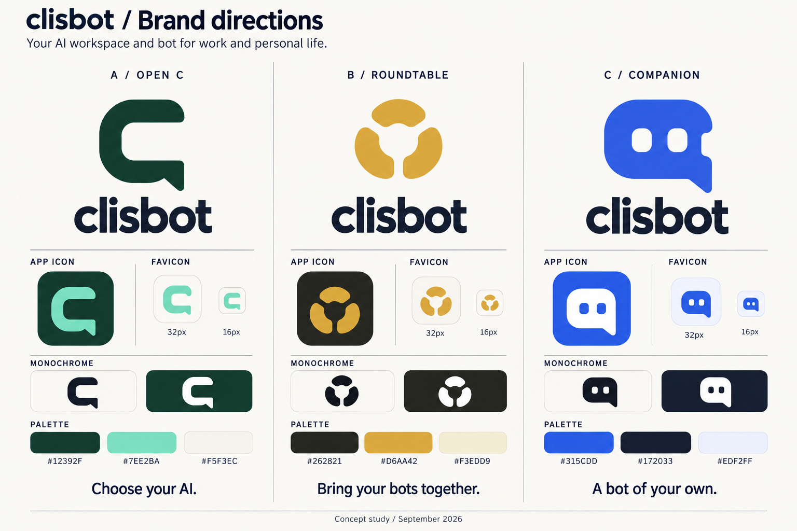

# Clisbot: ba hướng branding để review

**Lịch sử khảo sát A/B/C — lựa chọn hiện tại được ghi trong doc B1-A Flow.**

Hướng đã chọn và phương án dự phòng:
[B1-A Flow — workspace và chat](concept-b1-workspace-chat.md), sau vòng
[B1/B2/B3 với app icon nền tối](concept-b-refinement.md).
Bảng A/B/C dưới đây là các hướng ban đầu để giữ lịch sử review.

**Review bổ sung:** hình B trong board đầu cần thiết kế lại do gợi liên tưởng tới các
logo tech phổ biến và biểu tượng cảnh báo. Board giữ lại bản đầu để đối chiếu;
xem [nhận xét tương đồng](concept-b-review.md). A và C cũng chưa phải artwork
đã duyệt.

## Điểm chung

Clisbot là desktop workspace làm việc với AI cho office work và software
engineering, đồng thời là nền tảng bot cho công việc và đời sống. Người dùng chọn
provider/model, tạo bot chuyên môn và điều phối nhóm bot trong app; doanh nghiệp
có managed Hosts và phân quyền.

Logo cần có hình dáng riêng khi đứng một mình trên app icon, dùng được ở giao
diện làm việc lẫn chat, và giữ được nhận diện khi thu nhỏ hoặc chuyển sang đơn
sắc. Wordmark trong bản thử nghiệm là **clisbot** viết thường; đây là cách trình
bày logo, không phải quyết định đổi tên sản phẩm trong UI hay code.

## So sánh nhanh

| Hướng              | Ý tưởng nhận diện                                  | Điểm nhấn                                                | Điểm cần cân nhắc                                                                                    |
| ------------------ | -------------------------------------------------- | -------------------------------------------------------- | ---------------------------------------------------------------------------------------------------- |
| **A — Open C**     | Chữ C mở kết hợp nét đuôi hội thoại                | Tự do chọn AI, workspace mở, người dùng kiểm soát        | Cần giữ hình đủ riêng để không thành một chat bubble phổ thông                                       |
| **B — Roundtable** | Các phần tử cùng quây quanh một tâm chung          | Nhiều bot chuyên môn cộng tác trong một group            | Khi thu nhỏ cần tránh gợi cánh quạt hoặc biểu tượng cảnh báo; cần tinh chỉnh hình học trước khi chốt |
| **C — Companion**  | Biểu tượng hội thoại có hai mắt, gợi một bot riêng | Dễ tiếp cận, cá nhân hóa, dùng cho công việc và đời sống | Cần giữ vẻ chuyên nghiệp và tránh quá giống các logo chatbot phổ biến                                |

Các tên A/B/C chỉ dùng để gọi phương án trong vòng review, không phải tên sản
phẩm, tên feature hay sub-brand.

## A — Open C

**Cảm giác:** điềm tĩnh, có năng lực, tự do và rõ ràng.

Chữ C tạo một không gian mở; phần đuôi gợi hội thoại. Một hình dùng được cho cả
workspace và bot, phù hợp với thông điệp chọn agent harness/model và tự quản lý
môi trường chạy.

- Palette đề xuất: forest `#12392F`, mint `#7EE2BA`, paper `#F5F3EC`.
- Wordmark: sans mềm, rõ nét, độ nặng vừa; tránh cảm giác chỉ dành cho terminal.
- Câu diễn giải ngắn: **Choose your AI.**
- Hướng triển khai: một mark đơn sắc, bản đảo màu và nền app icon; màu trạng thái
  running/attention vẫn dùng ngữ nghĩa hiện tại của sản phẩm.

**Đề xuất ở vòng A/B/C ban đầu:** hướng A bao quát workspace, provider
freedom và hội thoại, phù hợp với cả người dùng cá nhân lẫn doanh nghiệp. Phần
native group bots có thể được diễn giải thêm bằng hình minh họa và nội dung sản
phẩm mà không cần nhồi mọi tính năng vào logo.

## B — Roundtable

**Trạng thái hình vẽ: cần thiết kế lại trước khi đưa vào vòng chọn cuối.**

**Cảm giác:** cộng tác, có tổ chức, cùng làm ra kết quả.

Các phần tử độc lập cùng chia sẻ một tâm chung: mỗi bot có vai trò và cách làm
việc riêng, nhưng cùng tham gia giải quyết một mục tiêu. Hướng này đưa điểm khác
biệt native group và quyền điều phối của người dùng lên trước.

- Palette đề xuất: graphite `#262821`, saffron `#D6AA42`, oat `#F3EDD9`.
- Wordmark: sans chắc, thân thiện, khoảng cách chữ vừa phải.
- Câu diễn giải ngắn: **Bring your bots together.**
- Hợp khi muốn người dùng nhớ tới Clisbot trước hết như nơi tổ chức nhóm bot.
- Bản hình hiện tại là nghiên cứu bố cục; cần tinh chỉnh các phần tử và khoảng
  âm để giữ nghĩa “cùng cộng tác” ở kích thước favicon.

Sau đối chiếu, đề xuất bỏ cấu trúc ba cánh theo vòng tròn. Giữ ý tưởng nhiều bot
cùng làm việc, nhưng phát triển bằng các ô hội thoại lệch trục cùng chia sẻ một
không gian. Đổi màu riêng lẻ không giải quyết được sự giống nhau của hình dáng.

## C — Companion

**Cảm giác:** gần gũi, dễ hiểu, có thể tạo một bot của riêng mình.

Hai mắt trong một khối hội thoại giúp nhận ra ý niệm bot ngay, còn dáng chữ C
gắn lại với Clisbot. Hướng này dễ dùng trong trải nghiệm tạo bot, chọn bot và
chat hằng ngày.

- Palette đề xuất: cobalt `#315CDD`, ink `#172033`, pale blue `#EDF2FF`.
- Wordmark: sans bo nhẹ, không dùng kiểu chữ hoạt hình.
- Câu diễn giải ngắn: **A bot of your own.**
- Hợp khi muốn nhấn mạnh sự dễ tiếp cận cho office worker và đời sống cá nhân.
- Cần giữ ảnh bot của người dùng phân biệt với logo ứng dụng: mỗi Bot vẫn có
  danh tính riêng, không phải bản sao của biểu tượng Clisbot.

## Cách chọn

- Chọn **A** nếu ưu tiên một nhận diện bao quát: workspace + tự do chọn AI + bot.
- Chọn **ý tưởng B để vẽ lại** nếu ưu tiên kể câu chuyện nhiều bot chuyên môn
  cộng tác ngay từ logo; không dùng nguyên hình hiện tại.
- Chọn **C** nếu ưu tiên sự thân thiện và ý niệm “bot của riêng tôi”.

Màu và hình có thể review riêng. Ví dụ, thích cấu trúc A nhưng muốn màu cobalt
của C vẫn là một yêu cầu tinh chỉnh hợp lý; chưa cần chốt cả bộ trong một lần.

## Từ concept đến asset dùng thật

Sau khi chọn hướng: dựng master SVG, tinh chỉnh khoảng âm/độ dày nét, kiểm tra
16/32/48 px thực tế, rồi sinh các biến thể app, desktop, favicon, splash và
notification từ cùng nguồn. Dùng [inventory](inventory.md) và
[favicon coverage](favicons.md) để kiểm tra đủ các vị trí.

Board được tạo bằng built-in `image_gen` ở dạng raster để review. Các thumbnail
favicon là minh họa; chưa phải file icon đã xuất đúng kích thước và chưa được
thử trong browser/app. Chưa khẳng định tính độc quyền của hình; cần rà tương đồng
trước khi chốt nhận diện. [Brief và prompt hiệu chỉnh](concept-generation.md).
