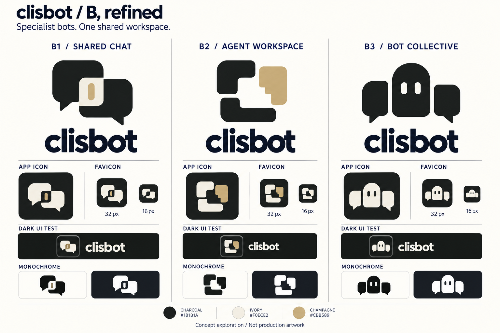

# B: nhóm bot trong một ứng dụng AI

**2026-09-30 — lịch sử khảo sát B1/B2/B3.**

**Vòng mới nhất:** người dùng yêu cầu B1 thành
[một workspace nối liền một chat](concept-b1-workspace-chat.md).
Các hình B1/B2/B3 bên dưới ghi lại bước khảo sát trước điều chỉnh đó.

Yêu cầu: cải tiến B để gợi ứng dụng AI rõ hơn, vẫn clean và đơn giản; màu trên
nền đen cần hài hòa, app icon cần được tinh chỉnh.

## Ba biến thể

| Biến thể                 | Dấu hiệu AI/app                                    | Ý nghĩa cộng tác                            | Nhận xét                                                                                          |
| ------------------------ | -------------------------------------------------- | ------------------------------------------- | ------------------------------------------------------------------------------------------------- |
| **B1 — Shared Chat**     | Hai ô hội thoại với dấu cursor ở khoảng giao nhau  | Nhiều chủ thể cùng tạo một cuộc hội thoại   | Ưu tiên trong vòng B này: gọn, gợi chat và hoạt động tạo nội dung; cần giữ khoảng âm rõ ở favicon |
| **B2 — Agent Workspace** | Ba module bo góc tạo một không gian làm việc chung | Các agent độc lập cùng đóng góp vào một nơi | Nghiêm túc, trừu tượng hơn; ý niệm AI ít trực tiếp hơn B3                                         |
| **B3 — Bot Collective**  | Một bot có hai mắt và hai ô hội thoại bên cạnh     | Nhiều bot cùng tham gia một nhóm            | Nhận ra bot nhanh nhất; ba khối khiến icon cần kiểm tra kỹ hơn khi thu nhỏ                        |

B1/B2/B3 là mã gọi ba biến thể hình, không phải tên mới của sản phẩm. Cả ba giữ
ý tưởng cộng tác của B và chuyển khỏi bố cục ba cánh xoay quanh tâm của board đầu.

## Nền tối và app icon

Palette đề xuất của vòng này:

| Vai trò    | Màu                 | Cách dùng                                                                         |
| ---------- | ------------------- | --------------------------------------------------------------------------------- |
| Nền icon   | Charcoal `#181B1A`  | Nền than mềm; cùng giá trị theme-color/background trong web shell và PWA hiện tại |
| Hình chính | Ivory `#F0ECE2`     | Phần lớn diện tích logo để giữ tương phản trên nền tối                            |
| Điểm nhấn  | Champagne `#CBB589` | Một chi tiết phụ/module nhỏ; không phủ phần lớn hình                              |

App icon được đề xuất với hình chiếm khoảng 58–62% chiều rộng, có khoảng thở và
căn giữa theo thị giác. Khi chuyển xuống favicon nhỏ nhất, ưu tiên silhouette
đơn sắc; có thể bỏ điểm nhấn quá nhỏ. Dải dark UI trên board dùng nền tối hơn
tile một chút để xem ranh giới icon và tỷ lệ cạnh tên ứng dụng.

Các giá trị trên là specification đề xuất, không phải phép đo xác nhận màu và
pixel trong ảnh do model tạo. Bảng là bản review raster; sau khi chọn sẽ cần
dựng SVG và xuất thử favicon 16/32/48 px thật. Bản đơn sắc và thumbnail trong
board hiện dùng để đánh giá hướng hình, chưa thay thế kiểm tra đó.

## Dữ liệu vòng thiết kế

- [Nghiên cứu hình trước feedback nền tối](images/clisbot-b-shape-study.png).
- [Prompt nghiên cứu hình](evidence/b-refinement-prompt.txt).
- [Prompt hiệu chỉnh app icon nền tối](evidence/b-dark-icon-correction-prompt.txt).
- [Nhận xét tương đồng của B ban đầu](concept-b-review.md).

Tạo bằng built-in `image_gen`. Hai bước: phát triển hình từ board đầu, sau đó
giữ ba hình để chỉnh palette nền tối, tỷ lệ app icon và cách trình bày. Không
thay asset runtime, favicon hoặc cấu hình sản phẩm trong vòng đề xuất này.
