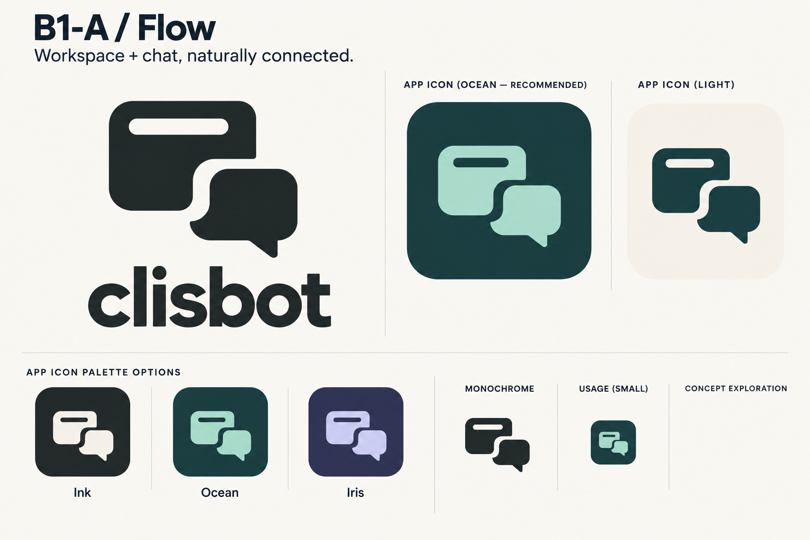
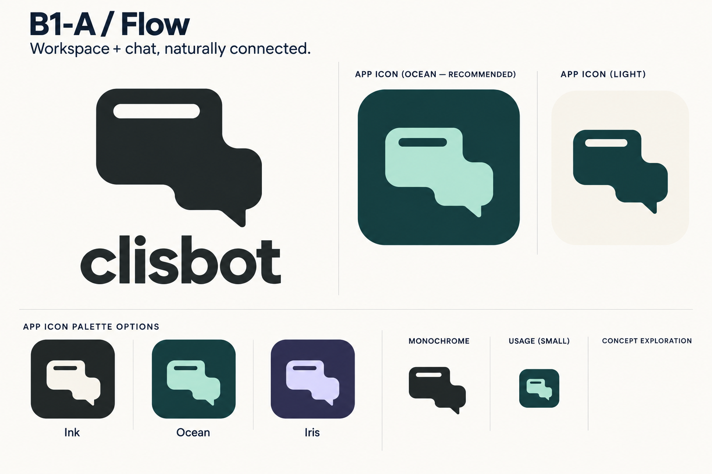
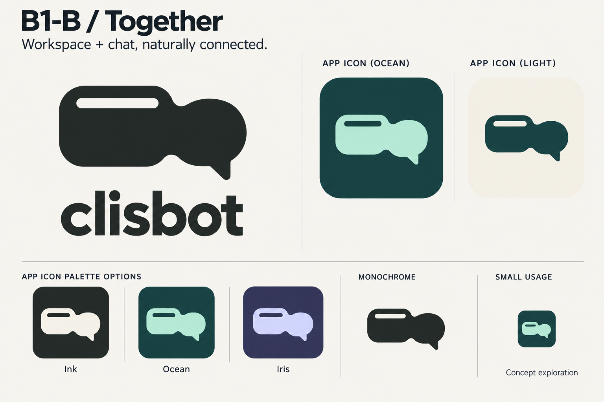
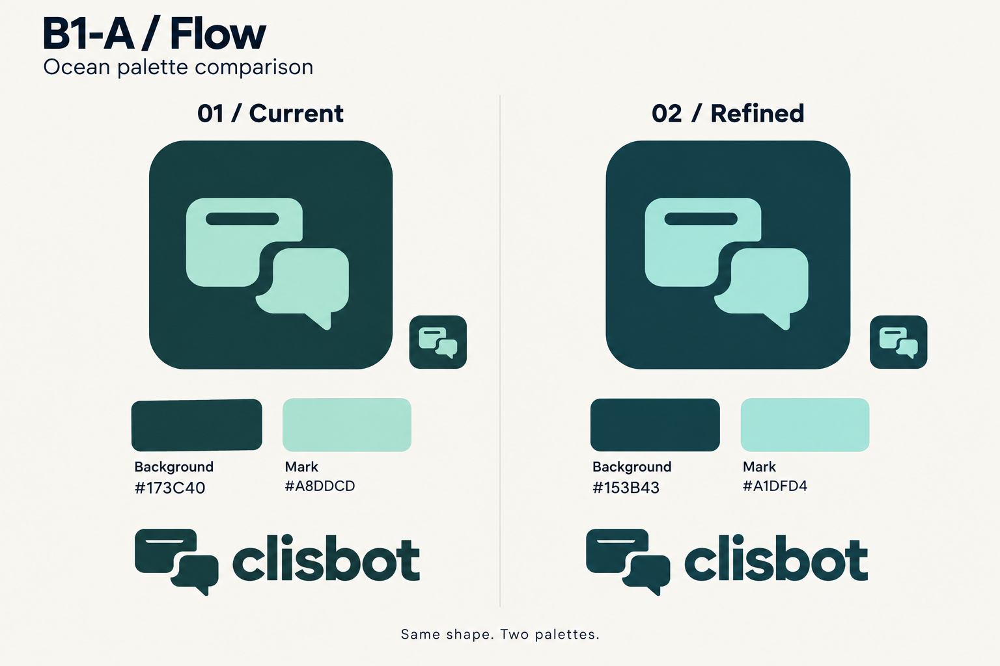
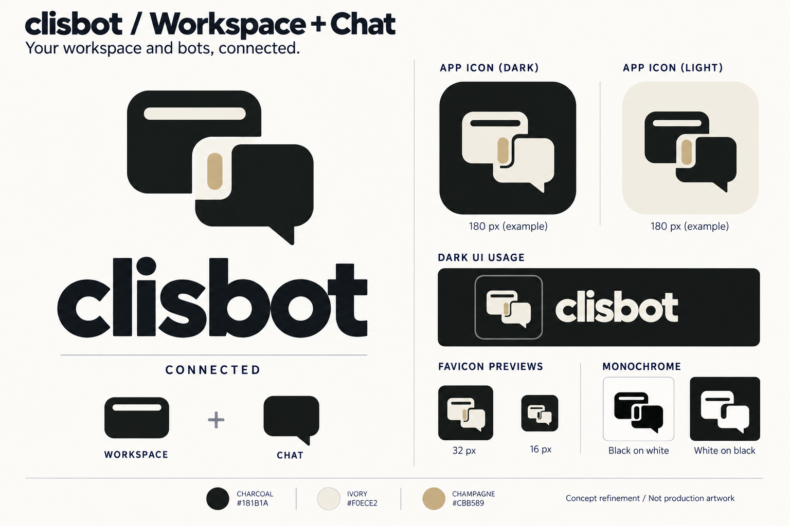

# B1: một workspace nối liền một chat

**2026-09-30 — chốt B1-A Flow bản chính + Ocean 02; đã xuất bộ asset và áp dụng trên nhánh test Fusion.**

Điều chỉnh từ [board B1/B2/B3](concept-b-refinement.md): B1 cần có **một cửa sổ
workspace và một ô chat nối liền nhau**. Bản hai ô chat trước đó là lịch sử
khảo sát hình, không phải cấu trúc của hướng hiện tại.

## Quyết định lựa chọn

Người dùng chọn **B1-A / Flow bản đầu làm phương án chính**, và **B1-A / Flow
bản sau làm backup**, xác nhận bằng hai ảnh đính kèm trong cuộc hội thoại.

- **Chính:** workspace trên trái, chat dưới phải, có khe cong dạng S giữa hai
  khối. Giữ khoảng âm này khi dựng vector và các biến thể kích thước.
- **Backup:** cùng bố cục chéo, hai khối nối thành một mảng đặc.
- **Màu chính thức:** Ocean 02 — nền `#153B43`, hình `#A1DFD4`, nền sáng `#F6F4EF`.
  Ink và Iris bên dưới là lịch sử khảo sát màu.
- **Bộ sản phẩm:** [master SVG và toàn bộ export](../../../assets/branding/clisbot/README.md);
  [phạm vi thay thế và kết quả kiểm tra](production-artifacts.md).

Việc nối thành một mảng ở vòng sửa sau chỉ áp dụng cho bản backup. Quyết định
này giữ bản đầu có khoảng âm làm nguồn tham chiếu chính thức cho thiết kế tiếp.

### Phương án chính — B1-A / Flow bản đầu

### Phương án dự phòng — B1-A / Flow bản sau

## Hai biến thể bổ sung và thử màu

Người dùng yêu cầu thêm hai biến thể, có màu, với mục tiêu tạo thiện cảm ngay
khi nhìn lần đầu. Giữ cấu trúc workspace nối liền chat; phát triển độ mềm của
đường nét, tỷ lệ hai khối và khoảng trống. Giảm độ nặng wordmark, bỏ thanh
cursor riêng ở mối nối để hình thoáng hơn.

| Biến thể            | Brief hình dáng                                                                       | Cảm giác hướng tới                                |
| ------------------- | ------------------------------------------------------------------------------------- | ------------------------------------------------- |
| **B1-A / Flow**     | Workspace trên trái, chat dưới phải; bản đầu có khe cong, bản sau nối thành một mảng  | Gọn, điềm tĩnh, phù hợp workspace làm việc        |
| **B1-B / Together** | Workspace và chat gần ngang hàng; chat cong mềm hơn, nối trực tiếp vào cạnh workspace | Cởi mở, thân thiện, phù hợp công việc và đời sống |

Flow và Together là nhãn để so sánh artwork trong vòng review này.

### B1-B / Together — lưu lịch sử khảo sát

### Ba phối màu dùng chung

| Palette   | Nền app icon       | Màu hình             | Ý đồ                                               |
| --------- | ------------------ | -------------------- | -------------------------------------------------- |
| **Ink**   | Charcoal `#202827` | Ivory `#F4F0E7`      | Điềm tĩnh, tương phản rõ, dễ đặt trong UI hiện tại |
| **Ocean** | Petrol `#173C40`   | Seafoam `#A8DDCD`    | Dịu, gần gũi, có màu nhận diện riêng               |
| **Iris**  | Indigo `#303455`   | Periwinkle `#D0D2F6` | Nhẹ, thiên về cảm giác công nghệ và sáng tạo       |

Ocean là màu chủ đạo đề xuất cho vòng này. Bản nền sáng dùng giấy ấm `#F6F4EF`
với hình petrol. Chỉ dùng hai màu cho mỗi app icon để giữ hình rõ và tránh
chia vụn workspace/chat. Hướng thân thiện đến từ độ cong, tỷ lệ và màu dịu;
đây là nhận định thiết kế, chưa có kiểm chứng về mức độ yêu thích của người dùng.

### Thử tinh chỉnh Ocean trên bản chính

Theo yêu cầu thử của người dùng, đặt hai phối màu cạnh nhau trên **B1-A Flow
bản đầu có khe cong**. Chỉ thử màu; lựa chọn hình chính và backup giữ nguyên.

| Bản              | Nền       | Logo      | Ý đồ                                             |
| ---------------- | --------- | --------- | ------------------------------------------------ |
| **01 / Current** | `#173C40` | `#A8DDCD` | Ocean ban đầu: nền petrol, logo xanh bạc hà nhạt |
| **02 / Refined** | `#153B43` | `#A1DFD4` | Nền nhích về xanh lam, logo xanh ngọc rõ hơn     |

Mức thay đổi chủ đích là nhẹ. Sau vòng review, người dùng chốt hướng **02 / Refined**
để tạo bộ artifact. Board được tạo bằng built-in `image_gen`;
[prompt đầy đủ](evidence/b1-a-ocean-comparison-prompt.txt). Khi dựng vector,
dùng mã màu trong bảng để so sánh màu phẳng chính xác; ảnh tạo bằng AI là
preview và có thể lệch màu hoặc hình học nhỏ giữa hai cột.

### Nguồn các board

Cả hai board được tạo bằng built-in `image_gen`, dùng board B1 bên dưới làm
reference. Prompt đầy đủ: [B1-A](evidence/b1-a-color-study-prompt.txt) và
[B1-B](evidence/b1-b-color-study-prompt.txt). Bản chính Flow là kết quả của
prompt đầu. Vòng sửa phần nối sau đó dùng prompt
[B1-A](evidence/b1-a-connection-correction-prompt.txt) và
[B1-B](evidence/b1-b-connection-correction-prompt.txt): mối nối phải có phần
hình chung, hai rãnh ngoài dừng trước khi cắt xuyên qua biểu tượng. Kết quả
Flow của vòng sửa này được chọn làm backup.
B1-B cần thêm [vòng sửa nền](evidence/b1-b-background-correction-prompt.txt)
vì kết quả trước đó bị tối và mất tương phản chữ.
Mã màu trong bảng là specification;
raster preview có thể lệch màu hoặc chi tiết giữa các lần vẽ. Thumbnail chỉ
giúp xem cảm giác khi thu nhỏ, chưa phải kiểm thử favicon thật.

## Bản B1 làm reference

### Cấu trúc hình

- **Workspace:** hình cửa sổ app bo góc, có một nét chia ngang tối giản để gợi
  giao diện làm việc; không có đuôi hội thoại.
- **Chat:** một khối hội thoại bo góc, có một đuôi ngắn.
- **Phần nối:** hai khối tiếp giáp ở góc trong, tạo một biểu tượng liền mạch.
  Cursor nhỏ ở phần nối là điểm nhấn gợi hoạt động AI; đây là chi tiết phụ.

Ý nghĩa: cuộc hội thoại và nơi làm việc thuộc cùng một ứng dụng. Logo giữ ý
niệm cộng tác của B, đồng thời nói rõ hơn hai bề mặt người dùng tương tác:
workspace và chat. Không cần thêm chữ AI hay biểu tượng trang trí để kể ý này.

### App icon và màu nền tối

- Nền charcoal `#181B1A`.
- Hình chính ivory `#F0ECE2`.
- Một điểm nhấn champagne `#CBB589` tại phần nối.
- Hình chiếm khoảng 60–64% chiều rộng tile theo brief; cần căn giữa theo thị
  giác khi dựng vector thật.
- Khi đơn sắc, phần nối dùng cùng màu mực với hình chính. Với favicon nhỏ có
  thể lược cursor; vẫn phải phân biệt cửa sổ workspace với ô chat.

Đây là specification định hướng, chưa phải thông số đã đo hoặc kiểm chứng trên
SVG. Board raster do model tạo cần được dùng để chọn hình và cân bằng màu;
chưa thay icon app hoặc favicon sản phẩm.

## Điểm review

1. Nhìn hình có nhận ra một cửa sổ app và một ô chat không?
2. Phần nối có làm hình gọn và liền mạch, hay giống hai icon ghép cơ học?
3. Palette nào tạo thiện cảm ở lần nhìn đầu và giữ hình rõ trên nền tối?
4. Khi thu nhỏ, đuôi chat và nét chia cửa sổ có còn phân biệt được không?

Nguồn bản reference: built-in `image_gen`;
[prompt chính xác](evidence/b1-workspace-chat-prompt.txt).
Input là board dark-icon của vòng trước. Tên sản phẩm vẫn là Clisbot;
“Workspace + Chat” chỉ mô tả concept.
