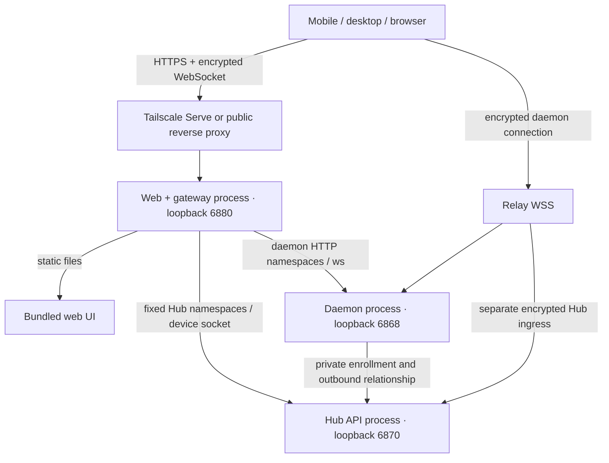

# Device pairing and Hub authentication

Decision: 2026-10-03. This document records the accepted behavior and implementation contract.
The latest work extends the pairing baseline with optional Hub startup, account URL entry,
protected owner setup, Google handoff and Account Sessions. Verification for that extension
is tracked separately in [implementation progress](device-pairing-implementation.md).

## Context

Personal onboarding must work from the distributed mobile, web and desktop app without a
custom build or a Hub account. A Hub relationship in the baseline also activates account-backed
Managed Access. Separate device trust, account authentication, authority and network routes.

## Decisions

- A pairing invitation expires after five minutes by default and grants one device access.
  Store its verifier, bind the first successful redemption to the device key, and make retries
  from that same device recover the result. Labels identify devices in the UI; they grant no
  authority. Credentials are private to a device and a backend.
- `managedAccess.mode = off`: the daemon authenticates and authorizes its own credentials.
  Hub credentials authorize Hub operations separately. The personal one-machine launcher
  prepares both grants so one QR pairs the app with both services.
- `managedAccess.mode = external`: the app authenticates with Hub once, using its account or
  approved pairing policy below. Hub grants access to enrolled
  daemons through the existing ticket, lease and Project authorization contracts. Selecting
  one daemon, a list or all managed daemons uses Hub grants, not a second permissions system.
  An all-daemons grant includes future enrolled daemons in the same organization.
- Hub account login is an instance policy, configured at deployment/bootstrap or changed by
  an authorized instance operator. When required and owner setup is complete, a Hub URL is
  enough to reach sign-in; manual device pairing is not required. Account authentication and
  grants are mandatory before management API access or ticket issuance. When required but
  owner setup is incomplete, the URL reports setup status only; an operator-approved pairing
  and owner-setup grant are required to create the owner. When login is not required, approved
  pairing is mandatory. Existing paired devices obey a newly enabled account policy.
  Service credentials retain their service scope.
- A Hub organization owner has full Hub authority in that organization and administration of
  its active enrolled `external` daemons. Owner login does not authorize a daemon at `off`;
  that daemon still requires its own credential. Instance operator is a separate scope.
- A daemon relationship exposes Hub discovery information. It does not itself authorize
  minting human Hub credentials. Combined pairing includes only grants approved by each
  backend's authorized operator. Never disclose the relationship credential to the app.
- Save Hub identity and endpoints at runtime. Credentials are scoped to stable backend
  identity, not hostname. Verify a new endpoint before sending credentials. Pairing method,
  account login, reachability and effective capabilities are separate app state.
  Failed re-pairing retains the working credential. A disconnected Hub selects its routes
  again; read retries use fresh proofs. A write with a lost response is reported to the caller
  without automatic replay because its result is unknown.
- Tailscale is the preferred direct route. Detect and guide installation/login; relay and
  public HTTPS remain supported. Hub relay is required in v1, alongside daemon relay, so
  onboarding works without installing or configuring Tailscale. Changing routes does not
  require pairing again. Future cloud relay entitlement can require its own cloud login
  without invalidating local credentials; relay connectivity is not deferred with billing.
- Daemon, Hub and web serving have independent process ownership. Hub HTTP traffic must not
  use the daemon as its default tunnel. A gateway is an optional serving boundary, not an
  authority. Reuse existing services; never restart a live daemon to enable Hub or web.
- Hubs explains the service before offering setup: Hosts run agents; a Hub provides channels,
  automations and shared administration. Direct personal Host use does not require a Hub.
  Prefer saved/detected Hubs; do not infer setup intent from opening this page. With no Hub,
  offer starting one on a connected Host, connecting an existing personal/team Hub or returning
  to Hosts. Open setup forms only after that choice; account policy remains independent.
  The shared “What is a Hub?” disclosure appears consistently across Hubs list, discovery,
  setup, connection and authentication/recovery screens. It defaults to expanded and remembers
  the user's explicit expand/collapse choice on that app installation, independent of selected
  Hub or account. In listings, distinguish selected context from effective access; a reachable
  Hub requiring sign-in is not presented as an authenticated “Connected” Hub.
- After Start Hub, show success only once the device has authenticated to that Hub, with a
  next step to set up a channel. Overview groups connection, account sign-in and paired-device
  controls into the existing settings rows; it does not repeat technical identity or account
  details in separate status cards. Account sign-in configuration opens a focused page, with
  visible owner email/password labels, a minimum 12-character password and explicit confirmation
  before changing policy. Explain that pairing is usually sufficient for one person's trusted
  devices, while account sign-in suits a shared Hub needing access per person. Reuse an existing
  owner sign-in method. Account roles decide access
  when sign-in is required; turning it off restores personal owner access to paired devices.
  Host managed access remains independent. Editing keeps the selected Hub fixed, and refreshing
  that Hub's capabilities preserves the draft.
- Use the shared Button variants consistently: one accent primary action in a connection,
  start or save form; Cancel and QR alternatives use outline buttons grouped with it. On narrow
  layouts the primary action takes a full row. Loading has a spinner and an explicit verb;
  disabled empty input and in-flight work remain distinct. Put connection errors beside the URL,
  explain retry/direct/relay recovery, and clear the previous target's notice when its address
  changes. Public identity discovery remains bounded, cookie-free and does not grant access.
- Revoking a device invalidates credentials and active/resumable sessions. Hub revocation
  covers its credentials and managed leases. With `off`, coordinated revocation reports each
  backend's result; an offline backend cannot be reported as already revoked. Disconnecting a
  socket alone is not revocation. A disconnected managed daemon loses access at lease expiry.
  In account mode, revoking a sign-in session ends that session and its refresh authority;
  a permitted account can sign in again. Persistent access denial requires account/resource
  policy. Do not present session revocation as a permanent device ban.

## Alternatives

Requiring pairing before every account login adds a separate approval ceremony even after
the operator has initialized account authentication. The revised entry uses account authority
for initialized Hubs and retains pairing for account-free access and protected first-owner setup.
First-owner creation never follows from possessing a URL or winning a first-request race.

Keeping login as an optional shortcut while accepting an owner pairing credential would let
that credential bypass account policy. Sharing one credential or letting a daemon issue Hub
owner credentials would widen authority across backend boundaries. Routing Hub REST through
the daemon would share its load and failure path with agent sessions. These are not defaults.

The T3 Code review used snapshot
[`67f640093ffea1adaa585949d87e4bc2010b0810`](https://github.com/pingdotgg/t3code/tree/67f640093ffea1adaa585949d87e4bc2010b0810),
especially its CLI pairing, pairing-grant store and proof-key binding. The reusable patterns are
short-lived QR invitations, device identity/labels, revocation and CLI-guided network setup.
Clisbot's separate Hub/daemon authorities, managed tickets and independently supervised gateway
adapt those patterns to a different lifecycle and multi-Host boundary.

## Compatibility and rollout

Isolate device pairing behind a feature switch. Disabled preserves the foundation's existing
pairing and account flows. Enabled requires the new device admission contract and advertises
one capability on `server_info.features`. New wire fields are optional. An old client cannot
receive owner authority on a protected endpoint and needs an app update before pairing. Existing
managed deployments keep their policy; only newly provisioned personal homes select `off`.

The pairing baseline replaced the account-only admission assumptions in the
[Managed Access baseline](../../audits/2026-08-31-unified-client-managed-access-lite.md) and the
relay-only QR assumptions in [Hub onboarding](../../hub.md). It preserves the existing
[permission owner chain](../../permissions.md). The revised Hub entry supersedes the baseline's
blanket pairing-before-login requirement; daemon admission and managed grants are unchanged.

## Accepted v1 scope and latest UX

- No additional public `serve` command. The upstream CLI snapshot
  `cc744cc669c6192b5b5a24e9e72171f2eedecc3b` has no such command. Keep `clisbot` and
  existing lifecycle commands as entry points; serving composition is an internal concern.
  The CLI and Desktop now use existing entry points. Internal serving modules retain their
  directory names without exposing a second public startup command.
- Release scope includes web, iOS, Android, Electron on macOS/Windows/Linux, and CLI on
  supported desktop operating systems. No platform is silently deferred. Passing macOS or
  browser tests does not satisfy the native/Windows/Linux release checks below.
- Hub relay connectivity is a v1 requirement and an immediate onboarding alternative to
  Tailscale. Use a separate encrypted Hub ingress, never a default Hub tunnel through daemon.
  Relay login/billing is a separate future policy, not a prerequisite added to personal
  Hub pairing. Daemon-to-Hub enrollment still needs its own reachable control-plane origin.
- Hub is optional and starts on explicit user intent. Prefer detected/saved Hubs; otherwise
  offer starting on a connected Host or connecting an existing Hub. An explicitly started
  Hub has independent supervision and continues running when the app closes. Opening the
  app does not create a Hub. Stopping Hub is an explicit lifecycle action.
- Sidebar group title is **Hub & Channel connect**. Global Hubs precedes the selected-Hub
  dropdown and scoped features. Host and sidebar Hub selectors use the existing borderless
  row style with search/autocomplete. The title-row Hub picker owns compact name/account/status
  information; remove the duplicated detail band between horizontal rules.
- The selected Hub's summary is named **Overview**, matching **Host → Overview**. Account
  management remains scoped to the selected Hub. Reuse the existing `/settings/hub/account`
  screen and preserve its Profile and other account controls; add a **Sessions** tab there,
  with current-session and last-active information and **Sign out** actions. Do not create a
  second Account screen or account authority. Account sessions remain separate from personal
  paired devices and agent sessions.
- Hub switching is disabled from the start of editing, including title/sidebar selectors and
  the Hubs list entry. Successful save or explicit Cancel unlocks; pending/failed saves keep
  the original Hub locked. No save/discard-and-switch confirmation is offered. Apply the rule
  to route editing, connection editing and owner creation. Preserve ordinary browsing/sign-in
  switching. Design v11 is the visual reference; automated runtime checks are tracked separately.
- Google and Google Workspace account sign-in are required in v1 on both direct and relay
  Hub routes, across the supported clients. Reuse existing Hub accounts and admission policy.
  Custom enterprise SSO providers such as Entra/Okta and configurable OIDC/SAML are separate
  scope decisions; Google support does not imply support for every identity provider.
- The encrypted Hub transport is required plumbing for pairing/relay. Google sign-in,
  Tailscale login and future relay entitlement login are independent. HTTP streaming/SSE
  is a separate delivery mechanism; preserve existing realtime behavior rather than treating
  deferral of SSE as permission to remove live updates.

## Google sign-in on direct and relay routes

Accepted on 2026-10-03. Google verifies identity; Hub owns accounts, registration, membership,
sessions and effective access. This extends the existing
[Google admission policy](../google-social-login/README.md), not the daemon's authority.

1. The client verifies the target Hub and obtains a short-lived sign-in challenge bound to
   that Hub identity and its device key. Before login, the connection permits only discovery
   and the bounded authentication exchange, not management or daemon tickets.
2. The client completes Google sign-in through the standard platform SDK or system-browser
   flow. Clisbot manages Google application registrations and a stable HTTPS sign-in page
   for official clients, so ordinary users do not configure callbacks for every Hub or build
   a custom app. Do not embed Google login in an Electron-controlled webview or distribute
   a confidential OAuth client secret with a public client or personal Hub.
3. The client submits Google's signed ID token over the authenticated encrypted Hub channel.
   Hub validates signature, trusted issuer and configured client audience, expiry, and the
   server-issued nonce against the pending Hub/device-bound challenge. An arbitrary nonce
   supplied with a token is not proof of a pending login. Reject replay and cross-Hub/device
   reuse; bind any browser-to-app handoff to the same transaction.
4. Hub resolves the Google subject to its account and applies existing invitation/domain,
   account-linking and role/resource rules before issuing its own device-bound session.
   Workspace restrictions use verified provider claims, not an untrusted email suffix.

This works without a public HTTP callback into a relay-only Hub. The sign-in page is an
additional trusted authentication surface; the opaque relay cannot authenticate a user or
grant Hub access. Operator-controlled provider availability remains independent of the Hub's
account-required policy. No-account Hubs continue to use pairing without Google login.

An initialized account-required Hub allows URL entry and sign-in without a manual pairing
invitation. An uninitialized Hub still requires operator-approved pairing and a setup grant
before Google or password login can create its first owner. Google authentication alone never
claims an uninitialized Hub, creates an organization owner, or authorizes an `off` daemon.

Legacy Google sign-in and native/Desktop browser authorization remain available with the
feature disabled. Protected transport adds an ephemeral login challenge and an ID-token
exchange with platform/system-browser handoffs. Release checks
must cover direct/relay sign-in, every supported client, cancellation/expiry, wrong Hub/device,
token replay, first-owner protection, account linking, revocation and both provider-policy states.
Official Google client registrations and sign-in-page deployment are release prerequisites;
this decision does not claim those credentials or services are already provisioned.

Protected Hubs use `CLISBOT_GOOGLE_ID_TOKEN_CLIENT_ID` (a public client ID), with no client
secret. It selects the accepted Google token audience. The managed authentication page must
be an authorized JavaScript origin of that Google project. Legacy redirect OAuth keeps its
separate client-ID/client-secret configuration when protected pairing is disabled.

The managed page returns popup ID tokens only to `https://app.clisbot.com`; arbitrary HTTPS
return origins would turn it into a credential-phishing proxy. Self-hosted web opens official
Clisbot web with the public Hub identity/route and continues management there. It never sends
a pairing token or owner-setup approval in that handoff. Mobile uses the fixed `clisbot://hub-google`
callback; Electron uses a random, one-use loopback callback and the system browser. Owner setup
with Google requires its approved device/setup grant in the client performing setup; email/password
setup remains available on self-hosted web.

## Implemented topology

The CLI is a launcher. Each backend has its own supervisor; the daemon is not the parent
of Hub or the web service. Ports below are preferences, with free-port selection on first
launch. A running gateway and the saved Hub port are reused; backend identities persist.
The home's recorded Tailscale HTTPS port is reused unless `--https-port` is supplied, so
starting Hub from the app preserves the existing web address and other homes' Serve mappings.



Web and gateway are **one Node.js process**: Express serves the existing built Expo web
assets and fixed HTTP/WS proxies. The implementation lives in
`packages/cli/src/commands/serve`; forwarding/static adapters reuse `@clisbot/server` and
namespace contracts from `@clisbot/protocol`. No new gateway framework/package is required.
Hub retains its own HTTP server, embedded database option and encrypted ingress. The new
`@clisbot/device-access` package contains portable signed proofs and backend authority/persistence.

Hub/gateway crash or reconfiguration can disconnect clients while those services recover.
It does not restart the daemon or its agents. A Hub outage can prevent new managed tickets;
existing managed sessions remain bounded by their lease. Process separation does not reserve
CPU/RAM at the OS level. Static assets and Hub tunnel requests do not use the daemon event loop.

Do not forward every `/api` request to Hub: both services own HTTP APIs. The fixed namespace
contract in `packages/protocol/src/hub-http.ts` determines routing. Gateway validates Host and
WS Origin, preserves forwarded Host/Origin and E2EE subprotocols, and never grants authority.
CLI updates the daemon's hostname/Origin policy through local configuration plus live reload.
Launch overrides that prevent the update produce an actionable error, with daemon preserved.

## Starting and stopping

From an installed version containing these changes:

```sh
clisbot                                  # existing onboarding; Hub remains optional
clisbot daemon start --home /path/to/home
clisbot hub start --personal --transport tailscale --home /path/to/home
clisbot hub start --personal --transport relay --home /path/to/home
clisbot hub start --personal --transport local --home /path/to/home
clisbot hub start --personal --transport https --public-url https://home.example.com
clisbot hub start --personal --label "My phone" --home /path/to/home --json
```

Existing onboarding prepares a new personal home with protected device pairing and managed
access `off`, starts/reuses daemon and optional web serving, then prints a Host invitation.
It does not create a Hub. **Start Hub** in the app selects a connected Host (the sole Host is
preselected), delegates to its installed CLI, and explicitly approves this device's Hub grant.
The app consumes that grant with its existing device key; there is no second QR ceremony in
the simple personal case. A Hub that is merely discovered still requires its own approval.

`hub start --personal` starts/reuses independently supervised Hub and gateway, bootstraps
the internal personal owner and enrolls the daemon using a private OS-approved machine token.
It prints a combined invitation for separately approved daemon and Hub grants. The machine
enrollment token never becomes a human pairing credential. Remote startup is available only
to the Host's independent protected owner credential in `off`; a Hub access ticket is not
authority to create or claim another Hub. Existing foreign relationships fail closed.

A running legacy daemon is preserved. Personal composition reports that device pairing must be enabled and
that its restart must be scheduled when safe; it does not automatically restart it. Existing
Hub accounts/organizations are never silently converted into a personal owner. Use a new home
for a personal instance or retain the existing account deployment's policy.

Desktop provisions the same personal settings on a fresh home and starts/reuses only daemon.
Explicit Start Hub invokes the CLI composition. The app registers its Hub profile at runtime,
without a build-time Hub URL. Startup failure is surfaced separately while daemon remains usable.
Cached desktop invitations are renewed before expiry.
The desktop **Pair device** action requests a fresh combined invitation through the local
operator CLI; startup's QR may already have been consumed. Direct-only QR offers remain
usable with relay disabled. For a remote Host, the app can combine an invitation from its
paired matching Hub when the current actor has instance-operator authority; an unrelated
selected Hub grants no pairing authority for that Host.

```sh
clisbot hub stop --web                    # only gateway + its supervisor
clisbot hub stop                          # only Hub + its supervisor
clisbot daemon stop                       # explicit daemon stop
clisbot hub stop --tailscale              # only the recorded Clisbot Serve mapping
```

Stopping a service retains its data/identity. Adding Hub never disables a daemon transport
already in use. No command above resets all Tailscale mappings or stops the Tailscale service.
Repeating personal Hub startup reuses existing services and refreshes the
invitation; it does not promise that an expired/consumed QR will keep working.

## Serving contexts and browser origins

| Context                                       | Entry point and Hub route                                                   | Pairing / browser behavior                                                                                                                                                                        |
| --------------------------------------------- | --------------------------------------------------------------------------- | ------------------------------------------------------------------------------------------------------------------------------------------------------------------------------------------------- |
| Local computer only                           | Gateway loopback; relative Hub paths and `/ws`                              | Self-host web QR, no account by default. A phone cannot reach another computer's `127.0.0.1`.                                                                                                     |
| Tailscale                                     | Serve HTTPS on the machine's `*.ts.net:8443`, pointing to gateway           | Install/sign in to Tailscale on host and phone. Same-origin web; direct route preferred, relay fallback when configured.                                                                          |
| Public HTTPS / Cloudflare tunnel              | User-managed TLS proxy/tunnel points to gateway                             | Supply its HTTPS origin via `--public-url`; support WS upgrades and preserve Host/Origin. Tunnel access policy is separate from Clisbot device authority.                                         |
| Official Clisbot web                          | `https://app.clisbot.com` connects to configured Hub/daemon                 | New paired Hub transport uses encrypted WSS request/response; server checks WS Origin. Direct HTTPS requires a reachable endpoint and browser network permission. Relay uses its own WSS ingress. |
| Relay only                                    | Official web/native app to separate daemon and Hub relay targets            | One QR; no Hub HTTP URL to `fetch`. Hub traffic never tunnels through daemon.                                                                                                                     |
| Hub and multiple daemons on separate machines | Each daemon enrolls outbound to reachable Hub; app keeps stable Hub profile | Discovery describes a Hub, not permission to pair it. Pair Hub with an approved Hub invitation. External Hosts use Hub grants/tickets; off Hosts need their own daemon credential.                |

Self-host web fetches and WebSockets use the gateway origin, so its normal HTTP calls are
same-origin. An official web page calling a user's backend is cross-origin even if that
backend has one gateway. The paired Hub implementation handles this through its encrypted
WebSocket adapter, not cross-origin cookie fetch. WS does not use CORS preflight; enforce
its Origin policy. Legacy cookie browser transport keeps its same-origin contract. Any future
direct cross-origin HTTP adapter must add its own CORS/header policy rather than assuming WSS
removed browser origin/security rules. HTTPS pages use `wss`; Local Network Access prompts and
reachability still depend on the browser and destination.

Tailscale must be installed to use its path, but it is not required to run Clisbot locally or
through relay/public HTTPS. The CLI detects missing/stopped/signed-out status and gives setup
instructions plus retry/relay/local choices. Noninteractive/JSON operation falls back to relay
and reports the actual selected transport. It does not install dependencies automatically.
`CLISBOT_TAILSCALE_BIN` selects a custom executable; Windows discovery checks Program Files and
`tailscale.exe`. Serve manages only the recorded authority/root mapping; an unowned or externally
replaced mapping is preserved. A new target can replace an unchanged Clisbot-owned mapping.

## Hub policy, managed access and capabilities

The accepted target distinguishes owner setup from ordinary account login:

| Hub account policy               | Daemon managed access    | Hub entry and authority                                                                                                                                          |
| -------------------------------- | ------------------------ | ---------------------------------------------------------------------------------------------------------------------------------------------------------------- |
| Login not required               | `off` (personal default) | Separate owner device credentials for Hub and daemon; combined QR is a convenience, not one shared authority.                                                    |
| Login not required               | `external`               | Personal Hub owner authority issues managed tickets for enrolled resources; daemon credentials cannot bypass external admission.                                 |
| Login required; owner ready      | `external`               | Hub URL → account sign-in; no manual pairing. Account role/grants decide Hub management and enrolled Host/Project access.                                        |
| Login required; owner ready      | `off`                    | Hub URL → account sign-in. Daemon still requires its independent credential; Hub owner role alone cannot enter it.                                               |
| Login required; setup incomplete | Either                   | Hub URL reports setup incomplete. Operator-approved pairing plus an owner-setup grant is required to initialize the owner; no URL-only claim or ordinary access. |

`packages/hub/src/device-access/auth-server.ts` admits initialized account Hubs through an
ephemeral, key-bound login challenge before account authentication. It exposes only public
Hub identity and the bounded login/verified-registration exchange; resource APIs remain closed.
A persistent login device credential is issued only after successful account authentication,
then the account session is explicitly bound to that device. A credential cannot borrow an
unbound or another device's owner cookie. Public login challenges prove possession of a temporary
key; state reads and failed account attempts keep no replay reservation. Account mutations serialize
per challenge, and successful admitted login consumes it for its remaining five-minute lifetime.
Ordinary paired-device nonce replay protection remains separate. Owner readiness comes from the existing instance-setup
owner, not from counting user rows. No-account and owner-incomplete Hubs still require approved pairing.

The local operator issues a short-lived, one-use owner-setup approval bound to Hub identity
and the redeeming device. Enforce it on every claim path, including social login, and serialize
claims through the existing transaction. Account login may automatically register its session
device for labeling/revocation; it does not mint account-free owner pairing authority. Turning
login off therefore cannot convert account sessions into owner grants. A relay service address
alone does not identify a Hub; its connection link must supply a specific Hub target/identity.

`CLISBOT_HUB_DEVICE_PAIRING=1` enables protected Hub admission. `CLISBOT_HUB_LOGIN_REQUIRED`
initializes **new persisted authority only**. Standalone protected Hub defaults to required;
`hub start --personal` defaults to false while honoring an explicit env
value. Once initialized, restarting with a different env value does not overwrite policy.

For a new personal home, no configuration or account is necessary. To switch it to account
mode, open **Settings → Hub & Channel connect → Instance settings → Account sign-in**
(also linked from Overview), provide an explicit owner email and password (at least 12
characters), then **Require account login**. This attaches a login
method to the same internal owner, preserving IDs, organization/resources and paired devices.
It does not create an implicit password or verify ownership of that email address. Enabling the
policy without a linked owner login method is rejected to prevent lockout. Device-only leases
are revoked; existing paired devices must now sign in. Login-only device grants do not automatically become owner grants
when policy is later disabled; owner access requires an independently approved owner invitation.

The local operator can inspect or change an initialized policy:

```sh
clisbot hub login-policy on --home /path/to/home
clisbot hub login-policy off --home /path/to/home
```

`on` also requires an existing login method. `off` requires a persisted personal owner; it
cannot turn an arbitrary team Hub into anonymous owner access. Remote policy/device management
requires instance-operator capability, not merely ownership of one organization.

Starting a fresh Hub with `CLISBOT_HUB_LOGIN_REQUIRED=true` still prints a combined pairing QR,
but reports `enrollment: account-approval-required`. Pair, complete the first-operator/account
setup, then enroll the Host through the approved `clisbot hub connect <HTTP-origin>` flow.
Personal auto-enrollment is not available in account-required mode. Existing enrollment survives
a personal-to-account upgrade.

Enrollment and managed access are separate. To require Hub access for an enrolled Host, the
organization owner uses **Host settings → Managed access → Require Hub access externally**, or
the local operator uses:

```sh
clisbot daemon config set daemon.managedAccess.mode external --home /path/to/home
clisbot daemon config set daemon.managedAccess.mode off --home /path/to/home
```

The existing grants select a Host/Project, a list or all organization Hosts. Members receive
only current granted access. Managed admission still validates the existing signed ticket and
lease; a paired owner credential does not bypass this. Switching `external` to protected `off`
closes ticket sessions, and clients need their daemon credential. The OS local operator remains
available for recovery; a forwarded browser/relay peer is never that operator.

The app keeps connection/pairing capabilities separate from account authentication. The
`connection` result exposes paired state, `loginRequired`, account authentication and effective
capabilities. Existing `signedIn` consumers receive an authorized personal-owner projection for
compatibility; UI must use `connection.accountAuthentication` to distinguish it from a real
account login. Resource APIs retain one role/grant resolver rather than duplicate personal rules.

## Pairing, profiles and revocation

```sh
clisbot daemon pair --label "My phone" --ttl 300 --home /path/to/home
clisbot hub pair --origin https://home.example.com --label "My phone" --ttl 300 --home /path/to/home
clisbot daemon devices ls --home /path/to/home
clisbot daemon devices rename DEVICE_ID "New phone" --home /path/to/home
clisbot daemon devices revoke DEVICE_ID --home /path/to/home
clisbot hub devices ls --home /path/to/home
clisbot hub devices rename DEVICE_ID "New phone" --home /path/to/home
clisbot hub devices revoke DEVICE_ID --home /path/to/home
```

Daemon pairing includes a Hub grant only when the local operator can independently approve it
for the enrolled local Hub. A remote daemon/Hub relationship does not mint Hub human credentials.
For separate machines, obtain one Hub-only QR from its operator and select the resulting Hub
profile. Pairing invitation TTL can be 1–900 seconds; default is 300. V3 offers combine daemon
and Hub invitations; V4 is Hub-only; V5 inventory contains public endpoints/pins with no pairing
secret. Legacy V2 stays available only under its existing admission behavior.

Each backend atomically binds the invitation to the device public key, stores only its verifier,
and requires a fresh signed nonce for retries/authentication. Ed25519 proofs bind the backend,
credential ID, purpose and request/session material. TLS and pinned NaCl E2EE protect transport;
knowing a backend public key does not grant access. Reusing a consumed invitation from a different
key, stale proof, reused nonce, wrong backend or revoked credential is denied.

Hub profiles are listed under **Hubs**, with labels and connection routes editable in the selected
Hub’s **Overview**, without rebuilding
the mobile/desktop app. HTTPS/Tailscale origin and relay endpoint are routes; Hub ID and public
key are trust identity. Changing routes retains credentials and checks the pinned backend before
sending proof. The compatibility `origin` field is a stable cache/relationship scope (`hub://ID`
for paired profiles); `connectionOrigin` is the actual HTTP route used in enrollment commands.
A relay-only Hub does not invent a CLI HTTP URL. Daemon→Hub enrollment still needs a reachable
HTTP/WS control-plane origin; app→Hub relay is a separate supported path.

Secrets stay out of ordinary profiles. Native uses SecureStore, web uses a nonextractable AES
key in IndexedDB with serialized Web Locks updates, Electron uses OS safeStorage and trusted
renderer IPC. The browser can still use credentials during XSS; storage encryption does not
make a compromised frontend safe. Host settings and Hub Overview expose device labels,
last-seen state, active sessions and revocation.

Hub revoke commits authority/lease invalidation before closing its device sockets and notifying
enrolled daemons. Daemon revoke closes bound active and resumable/pending sessions. In `off`,
revoke separately at each backend (UI/CLI exposes both lists); success on one does not claim
success on the other. If a Hub cannot notify a partitioned daemon, lease expiry is the bound.

Hub encrypted HTTP ingress accepts only fixed auth/management namespaces and methods; it cannot
proxy arbitrary URLs. Limits: 1 MiB request, 4 MiB response, 16 concurrent operations per socket,
64 total connections/operations, 120 requests per minute per socket, 8-second handshake and
15-second backend timeout with cancellation. Streaming/SSE is not part of this adapter.

## Verification and rollout

The counts below are **historical baseline evidence** from the earlier pairing implementation,
not the latest extension. Current implementation, review fixes, native build results and remaining
release gates are maintained in [device-pairing-implementation.md](device-pairing-implementation.md).

Verification evidence below is from isolated homes, free loopback ports and independent processes.
The user's running daemon was not restarted. Test entrypoints are checked into the repository:

```sh
# Build dependencies/backends and bundled web before the process tests.
npm run build:desktop-backends
npm run build:daemon-web-ui
RUN_SERVE_BROWSER=1 RUN_SERVE_RELAY=1 RUN_SERVE_BROWSER_RELAY=1 npm run test:e2e:personal-serving --workspace=@clisbot/cli
npm run test:e2e:personal-serving --workspace=@clisbot/desktop
```

These opt-in relay checks create isolated ephemeral service targets on the configured production
relay. They do not deploy a Hub/daemon or change a user's Tailscale mapping. Browser tests use the
new built frontend, including an official-origin asset fixture; they do not assert that the current
public app has already been updated.

| Verified surface              | Evidence                                                                                                                                                                                                                                                                                                                                                                                                                                                                                                    |
| ----------------------------- | ----------------------------------------------------------------------------------------------------------------------------------------------------------------------------------------------------------------------------------------------------------------------------------------------------------------------------------------------------------------------------------------------------------------------------------------------------------------------------------------------------------- |
| Device authority              | 9 tests: cross-process redemption race, hash-only storage, persistence, TTL, key binding, proof replay/context mismatch, revoked credentials, malformed state fails closed.                                                                                                                                                                                                                                                                                                                                 |
| Daemon admission              | 5 tests: protected direct/relay admission, anonymous/password rejection, session revocation/resume, external ticket has no interim owner authority, legacy feature-off compatibility.                                                                                                                                                                                                                                                                                                                       |
| Hub authority/ingress         | 3 tests: embedded migrations, personal owner without account/password, same-user account upgrade, persistent required login, no credential-only bypass, encrypted fixed-path ingress and cancellation/body bounds.                                                                                                                                                                                                                                                                                          |
| Hub managed-access regression | 13 tests: owner versus additive Team/Member grants, current-access checks, scoped delegation, ticket consumption and persisted revocation.                                                                                                                                                                                                                                                                                                                                                                  |
| CLI                           | 47 focused tests: lifecycle/state, enrollment policy, protected existing-Hub reuse, real HTTP/WS forwarding, Tailscale discovery/Windows binary and mapping ownership.                                                                                                                                                                                                                                                                                                                                      |
| App                           | 137 focused tests plus 2 real-browser storage tests: stable provider lifecycle, mutable profiles/pins, enrollment URLs, inventory/Host runtime, managed access transitions, IndexedDB encryption and concurrent writes.                                                                                                                                                                                                                                                                                     |
| Real processes + Chromium     | `packages/cli/tests/e2e/personal-serving.mjs`: one QR pairs both services, active sessions, private auto-enrollment, persistent Hub ID, independent Hub/gateway crash recovery with unchanged daemon PID/start time, web reload, required login, production API denial, owner login/session restore, forwarded public Host/Origin, separate production Hub relay, official-origin browser relay pairing/reload, off versus external tickets, lease revocation, relay→local, fresh required-login bootstrap. |
| Electron                      | `packages/desktop/e2e/personal-serving.electron.mjs`: actual Electron main/renderer fixture starts/reuses protected services, OS-encrypted storage, trusted renderer IPC, untrusted renderer/path traversal denied. Daemon-manager unit tests also pass.                                                                                                                                                                                                                                                    |
| Build/consistency             | Protocol, relay, device access, client, server, CLI, Hub, web and desktop-main builds; scoped typechecks/lint/format; migration/schema check; package dry runs for all six public packages; 10 CI contract tests.                                                                                                                                                                                                                                                                                           |

Logs and the web screenshot from this workspace's verification are under the ignored private
`.debug/scratch/device-pairing/` directory. Successful process fixtures remove their homes and
stop only owned services; failed fixtures retain private data for diagnosis. The two pre-existing
user-edited app files were preserved and their hashes checked.

The review follow-up verifies 76 passing focused tests across daemon authentication/reconnect,
Hub account upgrade, app transports, pairing UI and desktop lifecycle. Coverage includes MCP capability admission,
policy changes during a pending ticket handshake, mixed-case owner email, failed re-pairing,
direct-to-relay recovery and fresh proofs without write replay. The Electron fixture also checks
fresh combined sharing grants, foreign-Host rejection and unchanged daemon PID. Gateway HTTP
denies an unauthenticated MCP tool call. Follow-up logs are in `.debug/scratch/device-pairing-review/`.

The following deployment gates remain separate from source validation. Current platform execution
and package evidence are recorded in [device-pairing-implementation.md](device-pairing-implementation.md):

- Native camera, installed-app upgrade, signing and distribution. Android and iOS native builds
  and isolated simulator/emulator execution are tracked separately from store publication.
- Actual Windows/Linux process lifecycle and Electron packaging. The checked-in CI matrix includes
  a scoped Windows worker-crash probe and the actual Electron/asar child-launch fixture; local
  macOS execution does not establish a passing remote platform run.
- Actual Tailscale Serve mapping/certificate and Cloudflare/public TLS deployment. Tailscale
  commands/ownership are tested with controlled runner fixtures; public Host/Origin forwarding
  runs on real sockets. No user's Tailscale mapping or public deployment was changed here.
- Public web/native/CLI package release. Relay browser tests load the new built frontend at an
  official-origin fixture; today's deployed `app.clisbot.com` and installed older apps were not
  updated. Direct-serving QR loads the bundled new self-host web. Older clients cannot enter a
  protected backend without the new admission contract.

Paired account transport supports email/password, verified registration, first-operator setup and
Google/Workspace ID-token login over direct/relay routes. Legacy Google/system-browser OAuth remains
available on feature-off transports. The managed sign-in page and official Google project registration
still require deployment validation; mocked provider keys are not evidence of a real Google login.
HTTP streaming/SSE and relay entitlement/billing login are separate future work. Hub relay
connectivity is required in v1 and is already present in the remote app baseline; daemon→Hub
relay enrollment/control plane is not implied by it. Custom enterprise SSO remains separate scope.

This change adds three additive Hub migrations (`0087`, `0088`, `0089`) and public package dependencies; publish
`@clisbot/device-access` with its protocol/relay dependencies before client/server/CLI consumers.
The build/publish scripts and CI package checks include it. Packaging verification also repaired
relay browser exports that pointed to unshipped source files and included the server's already-declared
`tool-call-parsers` export in its build. Keep shared daemon/client/message
changes small during upstream sync; the feature helpers, authority package and serving boundary
carry the fork-specific behavior. Do not enable protected pairing on an existing deployment until
clients are upgraded and a safe daemon restart is scheduled. Full monorepo suites, signing and public releases are separate from the scoped validation recorded
in the implementation tracker.
