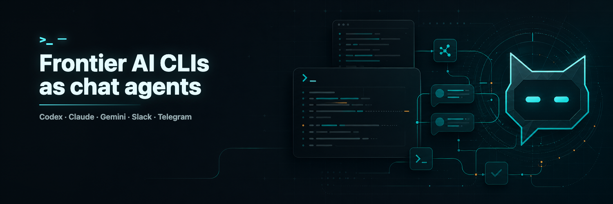

<p align="center">
  
</p>

<p align="center">
  <a href="../../../README.md">English</a> |
  <a href="./README.vi.md">Tiếng Việt</a> |
  <a href="./README.zh-CN.md">简体中文</a> |
  <a href="./README.ko.md">한국어</a>
</p>

<p align="center">
  <a href="https://www.npmjs.com/package/clisbot"></a>
  <a href="https://www.npmjs.com/package/clisbot"></a>
  <a href="../../../LICENSE"></a>
  
  
  
  
</p>

<p align="center">
  产品更新请关注 <a href="https://x.com/clisbot">x.com/clisbot</a>。
</p>

# clisbot - 把你喜欢的 coding CLI 变成可随身使用的 agentic 个人助理、工作助理和 coding 搭档

想用 OpenClaw / Hermes Agent，但卡在这些问题上：

- API 成本太高，最后不得不到处找 LLM proxy 方案
- 日常工作要用 OpenClaw / Hermes Agent，真正 coding 又要切回 Claude / Codex / Gemini
- 想在路上也能 coding 和工作

`clisbot` 正是为这个问题而来。

`clisbot` 把 Claude Code、Codex、Gemini CLI 这类原生 frontier agent CLI 变成跨多个渠道的持久 chat-native bot。当前渠道包括 Slack、Telegram、Zalo Bot、Zalo Personal，后续还会更多。每个 agent 都运行在自己的 tmux session 中，保留真实 workspace，可以作为 coding bot、日常工作助理，或带有 SOUL、IDENTITY、MEMORY 的团队助理。

它不是把 tmux 接到聊天上的薄桥。`clisbot` 把聊天平台当作真正的 channel surface 来处理，包括今天的 Slack、Telegram、Zalo Bot、Zalo Personal，并提供 routing、持久会话状态、pairing、follow-up control、文件收发，以及把 frontier coding agent 留在团队真实工作工具和沟通场景中的能力。

`clisbot` 也会继续成长为可复用的 agent runtime layer，在同一套 durable agent session 上支撑更多 CLI、更多渠道和更多 workflow 形态。

<a id="why-i-built-this"></a>
## 为什么我做 clisbot

我是 Long Luong（Long），Vexere 的联合创始人兼 CTO。Vexere 是越南排名第一的交通出行订票平台，我们也为交通运营商建设 SaaS 和票务库存分发基础设施。随着公司扩展到 300 人，其中 Engineering、Product、Design 团队超过 100 人，我一直在寻找最务实的方法，把 AI-native workflow 真正带进组织。

挑战不在于 AI 有没有用，而在于如何让 AI 在企业规模下真正工作，同时不制造一个碎片化、昂贵、难治理的技术栈。实际做起来，这意味着要同时解决成本控制、workflow 真实性、团队可达性、治理，以及把 frontier AI 带进真实工作发生的工具和沟通 surface。

`clisbot` 是我最终选择的路径。它不是再造一个孤立 AI 层，而是把我们已经信任的 coding CLI 变成持久的 chat-native agent，让它们能在 Slack、Telegram、Zalo surface 和真实团队 workflow 中工作。

如果 `clisbot` 帮到了你的 workflow，给一个 GitHub star 是让我知道它有用、也让更多人发现它的简单方式。

<a id="quick-start"></a>
## 快速开始

### AI 辅助 setup

如果你已经在用 Codex、Claude Code 或 Gemini CLI，先在这个 CLI 中打开本 repo，然后粘贴这个短 prompt：

```text
Help me clarify and set up clisbot from this GitHub repo: https://github.com/longbkit/clisbot
```

如果你已经清楚自己想要什么，可以粘贴这个更具体的 prompt 并补齐占位符：

```text
Help me clarify and set up clisbot from this GitHub repo: https://github.com/longbkit/clisbot

I want:
- target channel: <Slack|Telegram|Zalo Bot|Zalo Personal>
- coding CLI tool: <Codex|Claude Code|Gemini CLI>
- usage shape: <personal assistant|team assistant>
```

给 AI agent 的操作指南：用下面流程帮助用户以尽量少的摩擦安装、设置并开始使用 `clisbot`。

1. 只问必要的最少澄清问题，尤其是 target channel、coding CLI tool、usage shape。
2. 首次测试成功后，默认建议 persist credentials，这样后续重启可以直接 `clisbot start`，不用重新输入 token。
3. 阅读 `README.md` 和 `docs/user-guide/README.md`，然后引导最短且安全的 setup 路径。环境允许时运行正确的 `clisbot` 命令，并用 status/logs 验证。
4. 如果某一步必须手动完成，例如创建 bot、设置 Slack app、登录 Zalo Personal，请准确说明用户要做什么，并等待用户完成再继续。
5. 如果技术限制导致命令无法运行，给出用户需要执行的准确 terminal command。若未解决的 bug 阻塞 setup，帮助用户创建 GitHub issue 或通过 https://docs.google.com/forms/d/e/1FAIpQLSd7L7mHOo0ea8YXFI4tGnyDIj94ESn4hbbDa5YTbcEKTVOKTA/viewform 提交反馈。

平台支持：

- 当前支持 Linux 和 macOS 作为 host environment。
- Windows 用户请在 WSL2 中运行 `clisbot`，因为 native Windows 还不支持；`clisbot` 目前依赖 `tmux` 和基于 Bash 的 runtime flow。

### 手动 setup

大多数用户可以从这里开始：

```bash
npm install -g clisbot
clisbot start \
  --cli codex \
  --bot-type personal \
  --telegram-bot-token <your-telegram-bot-token> \
  --persist
```

如果只想先试用、不想持久化 token，去掉 `--persist` 即可。日常救援命令是 `clisbot stop`、`clisbot restart`、`clisbot status` 和 `clisbot logs`。

下一步：

- 为了安全，DM 默认进入 pairing。
- `clisbot` 也有 smart autopairing 路径来降低首次使用摩擦。如果你在最初 30 分钟内给 bot 发 DM，通常可以立即 claim owner role 并开始使用，不需要单独 pairing。

需要一步步 setup 文档，而不是最短路径？

- Telegram: [Telegram Bot Setup](../../../docs/user-guide/telegram-setup.md)
- Slack: [Slack App Setup](../../../docs/user-guide/slack-setup.md)
- Zalo Bot: [Zalo Bot Setup](../zh-CN/user-guide/zalo-bot-setup.md)
- Zalo Personal: [Zalo Personal](../zh-CN/user-guide/zalo-personal.md)
- Release 历史: [CHANGELOG.md](../../../CHANGELOG.md), [release notes](../../../docs/releases/README.md), [update guide](../../../docs/updates/update-guide.md), [release guides](../../../docs/updates/README.md), [migration index](../../../docs/migrations/index.md)
- Slack app manifest template: [app-manifest.json](../../../templates/slack/default/app-manifest.json)
- Slack app manifest guide: [app-manifest-guide.md](../../../templates/slack/default/app-manifest-guide.md)

接下来会发生什么：

- `--bot-type personal` 创建一个服务一个人的 assistant
- `--bot-type team` 创建一个服务团队、channel 或 group workflow 的共享 assistant
- 直接输入的 token 只留在内存中，除非你也传 `--persist`
- `--persist` 会把 token 写入标准 credential file，下次 `clisbot start` 可复用
- fresh bootstrap 只启用你显式指定的 channel
- 首次持久化成功后，后续重启可以直接用 `clisbot start`

<a id="page-index"></a>
## 页面索引

- [按需求开始](#start-by-need)
- [支持的渠道](#supported-channels)
- [适合谁](#who-it-is-for)
- [clisbot 的定位](#how-clisbot-fits)
- [Use Case Map](#use-case-map)
- [首次 setup FAQ](#first-setup-faq)
- [Routing 与 Access FAQ](#routing-and-access-faq)
- [Chat-Native Operator Experience](#chat-native-operator-experience)
- [Runtime 与 Workflow FAQ](#runtime-and-workflow-faq)
- [按症状排障](#troubleshooting-by-symptom)
- [排障 playbook](#troubleshooting-playbooks)
- [命令速查](#command-cheat-sheet)
- [相关文档](#related-docs)

<a id="start-by-need"></a>
## 按需求开始

| 需求 | 最佳起点 | 为什么适合 | 继续阅读 |
| --- | --- | --- | --- |
| 聊天里的个人 coding assistant | Telegram DM + `codex` | setup 摩擦最低，routed coding 行为强，workspace 持久。 | [Telegram Bot Setup](../../../docs/user-guide/telegram-setup.md), [Codex CLI Guide](../../../docs/user-guide/codex-cli.md) |
| 共享房间里的团队 assistant | Slack channel 或 Telegram group/topic + `codex` | 显式 route、默认 mention、安全 sender policy 更适合共享使用。 | [Slack App Setup](../../../docs/user-guide/slack-setup.md), [Routes](../../../docs/user-guide/channels.md) |
| 从 chat 使用 Claude Code | 任意 routed surface + `claude` | 保留 Claude-native command 和 skill。 | [Claude CLI Guide](../../../docs/user-guide/claude-cli.md), [Native CLI Commands](../../../docs/user-guide/native-cli-commands.md) |
| 带本地 memory 的 OpenClaw-style assistant | Personal 或 team bot + bootstrapped workspace | `AGENTS.md`、`USER.md`、`MEMORY.md`、pairing、routes、channel-native UX 都贴近 OpenClaw 习惯。 | [User Guide](../../../docs/user-guide/README.md), [Authorization And Roles](../../../docs/user-guide/auth-and-roles.md) |
| Hermes-agent-style background workflow | 定期 review 重复或曾经卡住的任务，用来创建和改进 skill。 | 一个 chat surface 就能把重复困难工作变成可复用 skill、review loop 和定期 brief。 | [Slash Commands](../../../docs/user-guide/slash-commands.md), [Runtime Operations](../../../docs/user-guide/runtime-operations.md) |
| Operator 救援与检查 | `clisbot status`, `logs`, `watch`, `runner inspect` | 查看 channel health、runtime pid、active runs 和 live runner pane。 | [Runtime Operations](../../../docs/user-guide/runtime-operations.md), [CLI Commands](../../../docs/user-guide/cli-commands.md) |
| Zalo 自动化 | Zalo Bot 或 Zalo Personal | Zalo Bot 偏 official DM；Zalo Personal 支持本地个人账号 DM/group，并默认保持静默直到 user/group 被 allowlist。 | [Zalo Bot Setup](../zh-CN/user-guide/zalo-bot-setup.md), [Zalo Personal](../zh-CN/user-guide/zalo-personal.md) |

<a id="supported-channels"></a>
## 支持的渠道

当前面向用户的 channel guide：

- [Slack App Setup](../../../docs/user-guide/slack-setup.md)
- [Telegram Bot Setup](../../../docs/user-guide/telegram-setup.md)
- [Zalo Bot Setup](../zh-CN/user-guide/zalo-bot-setup.md)
- [Zalo Personal](../zh-CN/user-guide/zalo-personal.md)

| Channel | 最适合 | 支持的 surface | Routing shape | 状态 |
| --- | --- | --- | --- | --- |
| Slack | 团队 channel、private group、工作助理 flow。 | DM、public/private channel、thread continuity。 | `dm:<userId>`, `group:<channelId>`, `group:*` | 稳定主 channel |
| Telegram | 个人 bot、移动 coding、groups、topic 隔离的团队 workflow。 | DM、group、forum topic。 | `dm:<userId>`, `group:<chatId>`, `topic:<chatId>:<topicId>` | 稳定主 channel |
| Zalo Bot | 官方 Zalo bot DM flow 和越南市场实验。 | 当前偏 DM。 | `dm:<user-id>`, `dm:*` | Alpha; polling-first |
| Zalo Personal | 本地个人账号自动化。 | DM 和 group，默认静默直到 user/group 被 allowlist。 | `dm:<user-id>`, `dm:*`, `group:<group-id>` | 支持的 local channel |

简单 capability map：

| Capability | Slack | Telegram | Zalo Bot | Zalo Personal |
| --- | --- | --- | --- | --- |
| Direct messages | Yes | Yes | Yes | Yes |
| Shared rooms | Channels 和 groups | Groups | 当前没有 group model | Groups |
| 子会话隔离 | Threads | Forum topics | No | 无 topic/thread model |
| Pairing / first access flow | Yes | Yes | Yes | Opt-in; 默认静默 |
| Route allowlists | Yes | Yes | DM allowlists | DM 和 group allowlists |
| Chat-native queue/loop | Yes | Yes | Yes, 偏 DM | Yes, route-scoped |
| Message send CLI | Yes | Yes | Yes, text 和 URL-backed photo path | Yes, text 和 file/URL media path |
| Inbound attachments | 通过 routed attachments | 通过 routed attachments | 图片/sticker 到 `.attachments/` | 图片和分组图片处理 |
| 最佳默认 runner | `codex` | `codex` | `codex` | `codex` |

按目标 surface 选择对应 channel guide。Slack 和 Telegram 是目前最稳定的 public user experience；当目标市场或测试 surface 需要 Zalo 时，用 Zalo Bot 或 Zalo Personal，并仔细看对应 channel guide 的安全说明。

<a id="who-it-is-for"></a>
## 适合谁

| 受众 | 常见目标 | 推荐形态 | 主要风险 |
| --- | --- | --- | --- |
| Solo builder | 从手机或 chat coding，同时保留真实 repo workspace。 | `--bot-type personal`, Telegram DM, `codex`. | Native CLI auth 或 host dependency 缺失。 |
| Office worker | 用 frontier agent 做 business work、marketing、research、writing、planning、reporting、follow-up，不必生活在 terminal 或另一个 AI app 里。 | `--bot-type personal`, 你最常用的 channel, `codex` 或偏好的 CLI。 | 在习惯和权限明确前给 bot 太宽的 workspace。 |
| Team member | 把 assistant 放进决策、文件、follow-up 已经发生的工作 channel。 | `--bot-type team`, shared room route, require mention, queue/loop for follow-up。 | 混淆共享 assistant 与私人 assistant；route 与 sender policy 必须明确。 |
| Business、marketing、operations team | 把 recurring reports、campaign briefs、customer/market research、doc updates、reviews、reminders、cross-functional requests 变成 chat-native workflow。 | Slack、Telegram、Zalo Bot 或 Zalo Personal，取决于团队真实 channel；用 queues 和 loops 做重复工作。 | timezone、sender identity 或 target channel 配错。 |
| Engineering lead | 把 assistant 放进 team channel，但不开放给所有人。 | `--bot-type team`, shared route allowlist, require mention。 | route admission 与 sender policy 混淆。 |
| AI workflow operator | 跑重复 review、status check、follow-up work。 | 基于 `/queue`, `/loop`, `clisbot queues`, `clisbot loops` 的 chat-native request。 | loop/queue 用错 sender、target 或 timezone。 |
| Claude-heavy team | 保留 Claude Code command 和 skill 习惯。 | `claude` runner, native command pass-through, 长任务打开 streaming。 | Claude plan approval 和 auto-mode behavior 仍可能出现。 |
| OpenClaw / Hermes Agent user | 在使用 frontier coding CLI 的同时保留 channel-native assistant ergonomics、memory、background work、skill evolution。 | Routed chat surfaces, memory files, workspace bootstrap, scheduled skill review loops。 | 假设每个 OpenClaw 或 Hermes 行为都能 1-1 映射。 |
| Platform builder | 把 clisbot 作为 local agent runtime layer 评估。 | Multiple agents, explicit routes, runtime inspection, queue/loop primitives。 | 模糊 channel、control、agents、runner 的边界。 |

<a id="how-clisbot-fits"></a>
## clisbot 的定位

`clisbot` 把 Codex、Claude Code、Gemini CLI 这类 native CLI agent 变成可通过 Slack、Telegram、Zalo 访问的持久 bot。每个 agent 都通过 tmux-backed runner 在真实 workspace 中运行，而 channel 负责 chat-native presentation、routing、pairing、file handling 和 follow-up behavior。

它解决的问题不只是“把 terminal 文本发到 chat”。它给 operator 一种更安全的方法，把昂贵的、subscription-backed coding agent 暴露到真实 communication surface，而不需要把每个 workflow 都重建成 API-only assistant 产品。

关键 fit：

- 需要最稳妥的 routed coding default 时用 Codex。
- Claude Code 本身最重要、并接受长任务需要更多 operator supervision 时用 Claude。
- Gemini auth 已经干净且明确想用 Gemini 时用 Gemini。
- 当目标是 memory、workspace continuity、pairing、channel-native UX、以及强 agent 的 routed chat access 时，用 clisbot 作为多数 OpenClaw-style assistant workflow 的更低成本 replacement。
- 当你需要 durable queue/loop primitives，以及在真实 coding-agent workspace 中创建和改进 skill 时，用 clisbot 做 Hermes-agent-style background workflow。
- 优先使用 chat-native operation：让 bot 创建 loop、添加 route、更新 clisbot、总结 release changes、或 inspect 自己的 runtime。Slash command 和 CLI command 仍是明确 control surface 和可靠 fallback。

<a id="use-case-map"></a>
## Use Case Map

| Use case | 常见 prompt | 有用 controls | 备注 |
| --- | --- | --- | --- |
| 快速 coding task | "Fix the failing test and send me the diff." | `/streaming on`, `/watch every 30s`, `/stop` | 除非需要别的 CLI，否则从 Codex 开始。 |
| Code review loop | "After this implementation, queue a code review against architecture and fix the issues." | Bot-created queue, `/queue`, `clisbot queues list` | Queue 让步骤顺序执行，而不是 steer 当前 run。 |
| Team group assistant | "@bot summarize this incident thread" | `routes add`, `routes add-allow-user`, `/mention` | Shared group 默认保持 require mention。 |
| Recurring operations brief | "Create a weekday 09:00 loop that checks CI and summarizes risk." | Bot-created loop, `/loop status`, `/loop cancel <id>` | 在创建响应里确认 timezone。 |
| Native Claude skill | "`/code-review`" | Native command pass-through | Slack 如果拦截 `/...`，前面加一个空格发送。 |
| Personal memory assistant | "Remember this project rule and update the workspace docs." | Bootstrapped `AGENTS.md`, `USER.md`, `MEMORY.md` | 不要把 private memory 带进 shared context。 |
| Mobile coding companion | "Continue the repo task from my phone." | `/attach`, `/detach`, `/watch`, `/new` | Workspace 留在机器上；chat 是 control surface。 |
| Bot self-update | "Update clisbot, follow the update guide, then summarize what changed." | Bot checks `clisbot update --help`, operator auth, `clisbot status` | 有权限时 bot 可执行 routine update path。 |
| Zalo local automation | "Allow this Zalo user or group to use the work bot." | `dm:*` allowUsers 或 exact `group:<id>` routes | Zalo Personal 默认静默，只开放给有意 allowlist 的 user/group。 |

<a id="first-setup-faq"></a>
## 首次 setup FAQ

### 应先选哪个 CLI？

一般 routed coding 体验优先选 `codex`，这是 clisbot 当前 operator 稳定性最强的默认选择。

当团队已经依赖 Claude Code、Claude-native commands 或 Claude-specific skills 时选 `claude`。长任务建议打开 streaming，方便看到 Claude 是否卡在 plan approval。

当 Gemini 已在 runtime environment 中完成 auth、并且你明确想用 Gemini 时选 `gemini`。如果 Gemini 打开 OAuth 或 setup screen，请先直接修好 Gemini auth。

相关页面：[Codex CLI Guide](../../../docs/user-guide/codex-cli.md), [Claude CLI Guide](../../../docs/user-guide/claude-cli.md), [Gemini CLI Guide](../../../docs/user-guide/gemini-cli.md).

### 应从 Telegram 还是 Slack 开始？

如果想要最简单的个人 bot 路径，用 Telegram。如果 workflow 以团队 channel 为主，用 Slack。route 明确后，Telegram topics 和 Slack threads 都适合作为隔离的 conversation surface。

相关页面：[Telegram Bot Setup](../../../docs/user-guide/telegram-setup.md), [Slack App Setup](../../../docs/user-guide/slack-setup.md).

### personal 和 team bot type 有什么区别？

`personal` 面向一个人，通常从 DM 开始。`team` 面向 shared room、team 或 group workflow，此时 routes、mention behavior 和 sender policy 更重要。

### 为什么首次运行需要 `--cli` 和 `--bot-type`？

Fresh config 没有 agent。`--cli` 选择 native runner，例如 `codex`、`claude` 或 `gemini`；`--bot-type` 选择初始 bootstrap shape。agent 创建后，后续 start 可以复用 config。

### clisbot 是 OpenClaw replacement 吗？

对多数 OpenClaw-style workflow 来说，是。clisbot 目标是成为这些常见 use case 更好、更便宜的 replacement，因为它复用你已经付费的 CLI tool subscription，而不是把你推向更昂贵的独立 API stack。

主要差异是 execution model。OpenClaw-style 系统通常指向 API 或独立 agent runtime；clisbot 在持久 tmux session 中运行 Codex、Claude Code、Gemini CLI 这类 native agentic coding CLI。今天这些 coding agent 仍是 coding 场景最强的 agentic AI 层，同时也足够通用，可覆盖 office work、research、planning、writing、operations 和 team follow-up。

### clisbot 是 Hermes agent 吗？

不是直接 clone，但 clisbot 是很多 Hermes-agent background use case 的实际 replacement。Durable sessions、queues、loops、workspace memory、chat-native control 与 background task、定期 review、skill evolution 很贴合。

你可以让 bot 在遇到困难 task 后创建 skill，在每日或每周节点改进 skill，或者 schedule review 重复和曾经卡住的 tasks 来创建/改进 skill。从操作角度看，这很接近 Hermes agent 自我创建和 evolve skills 的方式，但 clisbot 明确保留 channel、control、agent、config、auth、runner 的边界。

<a id="routing-and-access-faq"></a>
## Routing 与 Access FAQ

### 为什么 bot 在 DM 回答，但在 group 不回答？

DM 和 shared surface 是两个 gate。DM 可以通过 pairing 或 DM route。Group、channel、topic 需要明确 shared route，例如 `group:<id>` 或 `topic:<chatId>:<topicId>`，并可能要求 mention。

### `group:*` 是什么？

`group:*` 是一个 bot 下默认的 multi-user sender policy node。它不等于 admit 所有 group。当 bot 的 shared admission policy 是 `allowlist` 时，仍由 exact shared route 决定哪些 group、topic、channel 被 admit。

### 为什么 Slack channel 或 Telegram topic 的 deny message 也说 "group"？

Deny text 故意用一个面向人的通用词表示 multi-user surface。内部仍会把 provider-specific surface 映射到 `group`、`topic` 等 canonical route concept。

### 为什么 group 里默认需要 mention？

Shared surface 默认偏安全。Require mention 可以减少繁忙房间里的误触发。用 `/mention`、`/mention channel`、`/mention all` 收紧 mention behavior，或在明确希望 route 不需 mention 监听时用 `routes set-require-mention`。

### 如何只允许特定人使用 shared surface 里的 bot？

添加 route，保持或设置 policy 为 `allowlist`，然后添加 allowed users：

```bash
clisbot routes add --channel telegram group:<chatId> --bot default --policy allowlist
clisbot routes add-allow-user --channel telegram group:<chatId> --bot default --user <userId>
```

Surface policy 决定谁能 reach bot。Auth role 决定他们进来后能做什么。

相关页面：[Authorization And Roles](../../../docs/user-guide/auth-and-roles.md).

<a id="chat-native-operator-experience"></a>
## Chat-Native Operator Experience

### 我需要记住 slash command 和 CLI command 吗？

不需要。优先产品体验是 chat-native：直接告诉 bot 你想要什么，让它 inspect 相关 help、运行正确的 `clisbot` 命令并报告结果。

好的 prompt：

```text
Create a loop every weekday at 09:00 that checks CI and summarizes risk here.
Queue a code review after the current implementation finishes, then run tests.
Add this Telegram topic to the default bot if I am allowed to manage routes.
Update clisbot, follow the update guide, restart safely, and summarize what changed.
```

`/loop`、`/queue`、`/watch`、`/status` 等 slash command 仍然重要。它们是已知命令用户的精确 chat control surface。CLI 仍是需要精确、可脚本化 control 时的显式 operator surface 和 fallback。

### Bot-native configuration 如何保持安全？

clisbot 允许 bot 帮助配置自己，但不会把每条 chat message 都当成修改 protected state 的授权。

关键 guardrails：

- surface routes 决定 bot 可以在哪里回答
- auth roles 和 permissions 决定 sender 是否能管理 routes、queues、loops、runtime operations 或 protected resources
- agent prompt 要求 bot 针对 configuration、update、loop、queue、route request 使用 `clisbot` CLI help，而不是编造命令
- 敏感动作前应先做 read-only permission check，例如 `clisbot auth get-permissions --sender <principal> --agent <agentId> --json`
- runtime monitoring、`status`、`logs`、`watch`、`/attach`、`/stop`、`stop --hard` 给 operator 提供 native CLI 或 runner 卡住时的恢复路径

目标平衡是：你可以通过 chat 操作 clisbot，但 config change 仍经过明确 command surface、auth check、durable state 和可观察 recovery mechanism。

<a id="runtime-and-workflow-faq"></a>
## Runtime 与 Workflow FAQ

### run 很久时应该用什么？

用 `/attach` 在当前 thread 恢复 live updates。用 `/watch every 30s` 做周期更新。想让 run 安静继续但仍 post final result 时，用 `/detach`。

只有想中断当前 run 时才用 `/stop`。

### queue 和 steer 有什么区别？

`/queue <message>` 把 prompt 放到当前 run 后面，并按顺序稍后执行。适合 review-after-code、test-after-fix 或有意的多步骤工作。

`/steer <message>` 立即把 prompt 注入 active run。适合当前 run 走偏、必须马上纠正的场景。

### 什么时候创建 loop？

重复或定时工作用 loop。最简单路径是用自然语言让 bot 创建 loop：

```text
Create a loop every weekday at 09:00 that summarizes open operational risks here.
Run this review prompt 3 times, one after another, until the issues are fixed.
Check CI every 2 hours and summarize only actionable failures.
```

bot 应在需要时 inspect live loop help，通过 clisbot control surface 创建 loop，并报告解析后的 timezone 和 cancel command。需要精确语法时仍可直接用 `/loop ...`。

Loop 是 durable 且 session-scoped。可以问 bot、用 `/loop status` 或 `clisbot loops status` 检查 loop state。创建替代 schedule 前先取消 stale loop。

### 为什么 queued 或 looped prompt 没有立刻运行？

Managed loops 是 skip-if-busy，queues 会等待当前 logical run settle。这避免破坏 active conversation，或把不相关 prompt 堆进同一个 run。

### native CLI command 如何工作？

clisbot 保留少量 control command，例如 `/status`、`/stop`、`/queue`、`/loop`。其他 slash command 原样转发给底层 CLI。因此 Claude-native command 如 `/code-review`，以及 Codex-native 习惯如 `/review` 或 `$code-review` 仍可工作。

相关页面：[Native CLI Commands](../../../docs/user-guide/native-cli-commands.md).

<a id="troubleshooting-by-symptom"></a>
## 按症状排障

| 症状 | 首先检查 | 可能原因 | 修复 |
| --- | --- | --- | --- |
| `clisbot start` 提示没有配置 agents | `clisbot start --help` | Fresh config 还没有 agent。 | 同时传 `--cli` 和 `--bot-type` start。 |
| Token refs 显示 `missing` | `clisbot status` | runtime 看不到 env var。 | 重新传 token、persist token，或从已 export env 的 shell restart。 |
| Channel 一直 `starting` | `clisbot logs` | Credential、network、auth 或 provider startup failure。 | 修复 logs 里的 provider error 后 restart。 |
| Bot 在 DM 回答但 group 不回答 | group/topic 中 `/whoami` | 缺 shared route 或 mention requirement。 | 添加 `group:<id>` 或 `topic:<chatId>:<topicId>` route。 |
| message accepted 但没有 answer | `clisbot watch --latest --lines 100` | Runner 被 block、未 auth 或在等 prompt。 | 修复 workspace 中 native CLI 状态，然后 restart 或 `/new`。 |
| Native CLI runner 不回答 | 直接在 terminal 运行 `codex`、`claude` 或 `gemini` | 底层 coding CLI 未安装、未认证、未信任，或无法在本机运行。 | 先修 native CLI；clisbot 只能在 CLI 本身可正常回答后工作。 |
| Channel 或 runtime 像是卡住 | `clisbot status` 和 `clisbot logs` | Channel worker、detached runtime 或 tmux runner state stale。 | 先试 `clisbot restart`；不够再 `clisbot stop --hard` 然后 `clisbot start`。 |
| Claude 像是 stuck | `/streaming on` 和 `/watch every 30s` | Claude plan approval 或 auto-mode behavior。 | 如果在等 default confirmation，发 `/nudge`。 |
| Gemini startup block | `clisbot logs` | Gemini OAuth 或 setup screen。 | 直接认证 Gemini 或提供 headless auth path。 |
| Codex 报 missing env var | `clisbot watch --latest` | Detached runtime 没继承 shell env。 | 从有 env 的 shell restart clisbot，或配置 service env。 |
| Slack slash command 没到 clisbot | Slack client behavior | Slack 拦截 leading `/...`。 | 前面加空格，例如 ` /status`，或用 `\status`。 |
| restart 后旧行为还在 | `clisbot runner list` | stale tmux runner 或旧 environment。 | 用 `clisbot stop --hard`，再 start。 |
| update 或 restart 像是卡住 | `clisbot status` | Worker 已退出或 monitor 正在转换。 | 先 check status；runtime down 时运行 `clisbot start`。 |

<a id="troubleshooting-playbooks"></a>
## 排障 playbook

### 先检查 native CLI

当 clisbot 接受了 message 但 agent 不回答时，先把 clisbot 与底层 coding CLI 分开看。

1. 在同一台机器打开 terminal。
2. 进入 clisbot 预期使用的 workspace，通常是 `~/.clisbot/workspaces/default`。
3. 直接启动配置的 CLI：

```bash
codex
claude
gemini
```

4. 说 `hi`，确认 CLI 能回答。
5. 如果 CLI 不能 start 或 reply，先修安装、登录、trust prompt、model access 或本地 dependency。clisbot 无法让坏掉的 native CLI 工作；它只能运行和 route 已经能在机器上工作的 CLI。

### 重置卡住的 channel 或 runtime

如果 native CLI 在 terminal 中能工作，但 chat channel 仍卡住，就重置 clisbot runtime boundary。

1. 先尝试普通 restart：

```bash
clisbot restart
```

2. 如果 stale tmux sessions 或旧 channel state 还在，hard-stop 所有 clisbot tmux sessions 并重新 start：

```bash
clisbot stop --hard
clisbot start
```

3. restart 后运行 `clisbot status`，并从目标 channel 发一条小 test message。

### Bot 无法启动

1. 运行 `clisbot status`。
2. 运行 `clisbot logs`。
3. 确认 token refs 存在且 channel enabled。
4. 第一次运行时同时包含 `--cli` 和 `--bot-type`。
5. 如果普通 restart 不够，运行 `clisbot stop --hard`，再从正确 environment 的 shell start。

### Bot 在 routed surface 不回复

1. 在 surface 里发送 `/whoami`。
2. 用 `clisbot routes list --channel <channel>` 确认 exact route 存在。
3. 确认 sender policy 没有 block user。
4. 当 `requireMention` 为 true 时，确认 message mention 了 bot。
5. 一条 test message 后运行 `clisbot watch --latest --lines 100` inspect runner pane。

### Runner 像是卡住

1. 运行 `clisbot runner list`。
2. 运行 `clisbot runner inspect --latest`。
3. 用 `clisbot watch --latest --lines 100` 查看 live pane。
4. 直接打开 workspace，通常是 `~/.clisbot/workspaces/default`。
5. 在那里启动 native CLI，清掉 auth、trust 或 dependency prompts。
6. 根据 run 是在等待、走错方向还是需要新 conversation，使用 `/nudge`、`/stop` 或 `/new`。

### Access Control 难理解

1. 分清两个问题：
   - route policy: 这个 sender 能不能 reach 这个 surface？
   - auth role: admission 之后这个 sender 能做什么？
2. 使用 `clisbot routes get --channel <channel> <route-id> --bot <bot>`。
3. 使用：

```bash
clisbot auth get-permissions --sender <principal> --agent <agentId> --json
```

4. 记住 `disabled` 胜过 owner/admin，`blockUsers` 仍然胜出。

### Queue 或 Loop 行为意外

1. 用 `/status` 检查当前 session。
2. 用 `/queue list` 或 `clisbot queues list` 查看 pending queue items。
3. 用 `/loop status` 或 `clisbot loops status` 检查 loops。
4. 确认创建 response 中的 loop timezone。
5. 创建替代 schedule 前取消 stale loops。

<a id="command-cheat-sheet"></a>
## 命令速查

| 任务 | Command |
| --- | --- |
| 启动第一个 Telegram personal bot | `clisbot start --cli codex --bot-type personal --telegram-bot-token <token> --persist` |
| 启动第一个 Slack team bot | `clisbot start --cli codex --bot-type team --slack-app-token <xapp> --slack-bot-token <xoxb> --persist` |
| 检查 runtime health | `clisbot status` |
| 读取最近 logs | `clisbot logs` |
| Inspect live runner output | `clisbot watch --latest --lines 100` |
| 添加 Telegram group route | `clisbot routes add --channel telegram group:<chatId> --bot default` |
| 添加 Telegram topic route | `clisbot routes add --channel telegram topic:<chatId>:<topicId> --bot default` |
| 添加 Slack channel route | `clisbot routes add --channel slack group:<channelId> --bot default` |
| Approve DM pairing | `clisbot pairing approve <channel> <code>` |
| Hard reset runtime sessions | `clisbot stop --hard` |
| 显示 update instructions | `clisbot update --help` |

<a id="related-docs"></a>
## 相关文档

- [User Guide](../../../docs/user-guide/README.md)
- [CLI Commands](../../../docs/user-guide/cli-commands.md)
- [Runtime Operations](../../../docs/user-guide/runtime-operations.md)
- [Routes](../../../docs/user-guide/channels.md)
- [Surface Access Model](../../../docs/user-guide/surface-access-model.md)
- [Bots And Credentials](../../../docs/user-guide/bots-and-credentials.md)
- [Authorization And Roles](../../../docs/user-guide/auth-and-roles.md)
- [Slash Commands](../../../docs/user-guide/slash-commands.md)
- [Agent Progress Replies](../../../docs/user-guide/agent-progress-replies.md)
- [Telegram Bot Setup](../../../docs/user-guide/telegram-setup.md)
- [Slack App Setup](../../../docs/user-guide/slack-setup.md)
- [Zalo Bot Setup](../zh-CN/user-guide/zalo-bot-setup.md)
- [Zalo Personal](../zh-CN/user-guide/zalo-personal.md)

## CLI Compatibility Snapshot

`clisbot` 当前与 Codex、Claude、Gemini 配合良好。

| CLI | 当前稳定性 | 简短结论 |
| --- | --- | --- |
| `codex` | 目前最佳 | routed coding work 的最强默认选择。 |
| `claude` | 可用但有 caveats | Claude 即使用 bypass-permissions 启动，也可能出现自己的 plan-approval 和 auto-mode behavior。 |
| `gemini` | 完全兼容 | Gemini 是 routed chat-native workflow 的 first-class runner。 |

CLI-specific operator notes：

- [Codex CLI Guide](../../../docs/user-guide/codex-cli.md)
- [Claude CLI Guide](../../../docs/user-guide/claude-cli.md)
- [Gemini CLI Guide](../../../docs/user-guide/gemini-cli.md)

## 最近 release highlights

- `v0.1.52`: 澄清 shared-route setup，让 `routes add ...` 明确表示“默认使用当前分配给该 bot 的 agent”，并清理 stale 的短 `startupDelayMs` override，让已升级安装能继承新的 60 秒 startup default。
- `v0.1.51`: 将标准 CLI family 和 shared runner fallback 的默认 runner startup window 提高到 60 秒，降低较慢 fresh launch 在首个 prompt submit 前失败的概率。
- `v0.1.50`: 更强的 AI-native operator experience，可以越来越多地通过 chat 让 bot 管理自身；同时带来更安全的 personal/team bot、旧安装自动 direct update、durable queue control、更真实的 session continuity、更可靠的 scheduled loops、更强的 trust/restart behavior、更严格的 streaming/session isolation。
- `v0.1.43`: 更 durable 的 runtime recovery、更清晰的 routed follow-up control、更真实的 tmux prompt submission check、更好的 queued-start notifications，以及更安全的 Slack thread attachment behavior。

当前 stable line 对你通常意味着：

- 头条是 AI-native control：在 chat 里要求 bot queue work、schedule recurring briefs、更新自己、解释 release changes、或 guide setup/routing，而不是每一步都下到 shell。
- personal user：长 run 脆弱性更少，`/queue` 更好，Telegram media handling 更好。
- shared bot owner：route safety 更清晰，从旧 install direct upgrade 更容易，一个 bot 待在 group 里但只回复选定用户的 team use case 更有意思。
- operator：queue visibility 更好，session continuity truth 更好，update 期间 restart behavior 更少误导，出问题时 `watch` 和 `inspect` 更快。

完整说明见：

- [CHANGELOG.md](../../../CHANGELOG.md)
- [Release Notes Index](../../../docs/releases/README.md)
- [v0.1.52 Release Notes](../../../docs/releases/v0.1.52.md)
- [v0.1.51 Release Notes](../../../docs/releases/v0.1.51.md)
- [v0.1.50 Release Notes](../../../docs/releases/v0.1.50.md)
- [v0.1.43 Release Notes](../../../docs/releases/v0.1.43.md)
- [v0.1.39 Release Notes](../../../docs/releases/v0.1.39.md)

## Showcase

目标是真正的 chat-native agent surface，而不是 terminal transcript mirror：threads、topics、follow-up behavior、file-aware workflows 都应在每个 supported channel surface 上感觉 native。

Slack


Telegram


## 重要提醒

大厂对 security 和 safety 的投入，并不会让 frontier agentic CLI tools 天然安全。`clisbot` 通过 chat 和 workflow surface 更广泛地暴露这些工具，所以请把整个系统视为 high-trust software，并自行承担使用风险。

## 致谢

没有 OpenClaw 带来的想法、势能和实践启发，就不会有 `clisbot`。这里许多 configuration、routing、workspace concept 都来自对 OpenClaw 的学习，再按 `clisbot` 自己的方向调整。向 OpenClaw 项目和社区致以感谢。

## Docs

- [Localized Docs Hub](../README.md)
- [Vietnamese Repo README](./README.vi.md)
- [Simplified Chinese Repo README](./README.zh-CN.md)
- [Korean Repo README](./README.ko.md)
- [Overview](../../../docs/overview/README.md)
- [Architecture](../../../docs/architecture/README.md)
- [Development Guide](../../../docs/development/README.md)
- [Feature Tables](../../../docs/features/feature-tables.md)
- [Backlog](../../../docs/tasks/backlog.md)
- [User Guide](../../../docs/user-guide/README.md)

## Roadmap

已交付基础：

- Native CLI runners: Codex、Claude Code、Gemini CLI。
- Channels: Telegram、Slack、Zalo Bot、Zalo Personal。
- Workflow primitives: durable queues 和 loops 已足够稳定，可用于真实 chat-native operations work。

下一步重点：

- 标准化 auto-skill creation 和 improvement，类似 Hermes agent pattern：重复或曾经卡住的任务，应通过 daily/weekly review loops 变成可复用 skills。
- 增加下一波 channel：Discord 和 WhatsApp Personal unofficial。
- 围绕 durable tmux runner boundary 继续改进 runtime safety、recovery、channel-native operator experience。

## AI-Native Workflow

这个 repo 也是一个小型 AI-native engineering workflow 示例：

- 简单的 `AGENTS.md` 风格 operating rules，Claude 和 Gemini compatibility files 可 symlink 回同一来源
- lessons-learned docs 记录重复反馈和 pitfalls
- architecture docs 作为稳定 implementation contract
- end-to-end validation expectations 用来闭合 AI agents 的 feedback loop
- workflow docs 记录 shortest-review-first artifacts、repeated review loops、task-readiness shaping，见 [docs/workflow/README.md](../../../docs/workflow/README.md)

## Bug Report

首选 bug report 方式是在这个 GitHub repo 创建 issue。你也可以通过 [Google Form](https://docs.google.com/forms/d/e/1FAIpQLSd7L7mHOo0ea8YXFI4tGnyDIj94ESn4hbbDa5YTbcEKTVOKTA/viewform) 提交。

请包含：

- clisbot version
- 使用的 channel 和 runner
- 你期望发生什么
- 实际发生什么
- 相关 `clisbot status` 或 `clisbot logs` output，移除 secrets

## Contributing

欢迎 merge request。

带有真实 tests、screenshots 或 behavior recordings 的 MR 会更快被合并。
