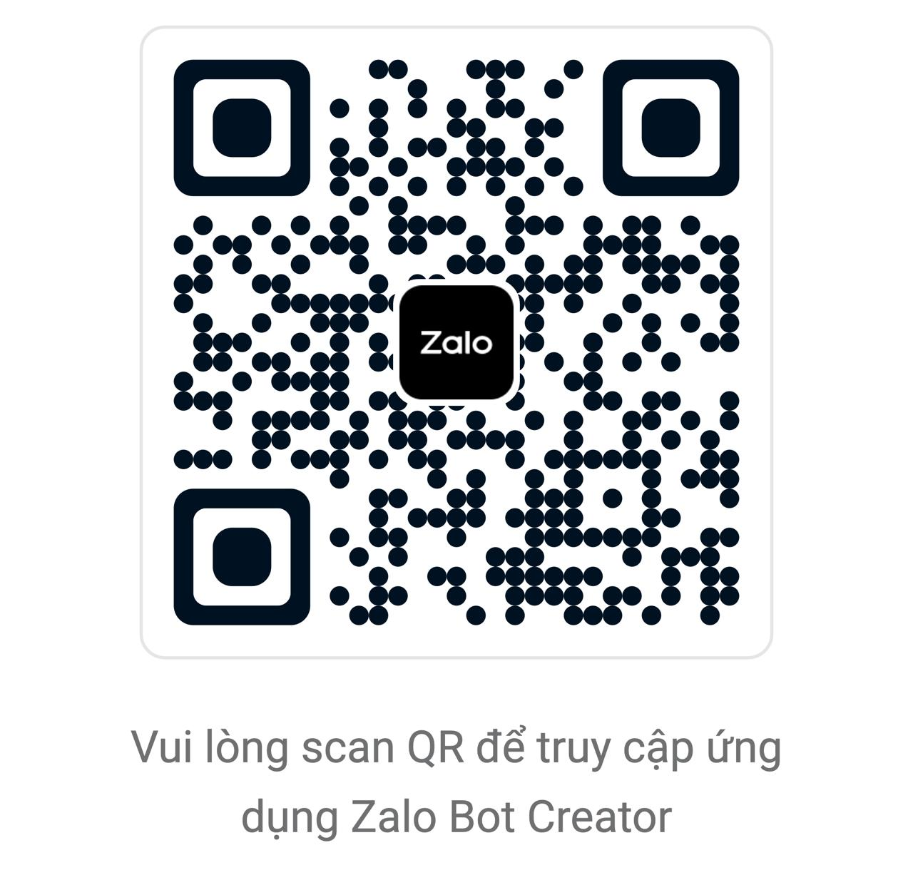

[English](../../../user-guide/zalo-bot-setup.md) | [Tiếng Việt](./zalo-bot-setup.md) | [简体中文](../../zh-CN/user-guide/zalo-bot-setup.md) | [한국어](../../ko/user-guide/zalo-bot-setup.md)

# Thiết lập Zalo Bot

## Phạm vi

Trang này nói về provider chính thức `zalo-bot` trong `clisbot`.

Trang này không bao gồm:

- Zalo OA
- tự động hóa tài khoản cá nhân không chính thức

## Tạo Zalo Bot

Dùng luồng chính thức của Zalo Bot Creator để tạo bot và lấy bot token. Hướng dẫn chi tiết từ Zalo ở đây: [Tạo Bot](https://bot.zapps.me/docs/create-bot).

Luồng nhanh:

1. Mở Zalo và quét QR code dưới đây để mở Zalo Bot Creator.
2. Tạo bot. Zalo yêu cầu tên bot bắt đầu bằng `Bot`, ví dụ `Bot MyShop`.
3. Sau khi tạo thành công, Zalo sẽ gửi thông tin bot và `Bot Token` vào tài khoản Zalo của bạn.
4. Dùng token đó làm `ZALO_BOT_TOKEN` trong các lệnh setup clisbot bên dưới.



## Mental Model

`zalo-bot` gần với Telegram hơn Slack:

- một bot token
- runtime ưu tiên polling
- các flow operator, queue, loop hiện tại chỉ dùng DM
- không có topic hoặc thread model

Giới hạn quan trọng hiện nay:

- outbound text được chia chunk ở `2000` ký tự
- native text send chỉ là plain text; `clisbot` có thể render markdown input thành plain text dễ đọc, nhưng Zalo Bot không expose rich text kiểu Telegram HTML hoặc Slack mrkdwn
- gửi ảnh hiện cần absolute HTTP hoặc HTTPS URL mà Zalo fetch được; local file path, `file://` URL, hoặc `localhost` URL là chưa đủ
- inbound image và sticker message được download vào cây `.attachments/` của routed workspace và truyền cho agent như attachment mentions
- webhook mode chưa được implement; hãy dùng polling

## Dev Flow Ưu Tiên

Repo-local dev commands cố ý dùng `~/.clisbot-dev`.

Kiểm tra dev runtime hiện tại:

```bash
bun run status
```

Persist hoặc update dev bot token:

```bash
bash ./scripts/run-dev-cli.sh bots set-credentials \
  --channel zalo-bot \
  --bot default \
  --bot-token ZALO_BOT_TOKEN \
  --persist
```

Enable bot nếu cần:

```bash
bash ./scripts/run-dev-cli.sh bots enable --channel zalo-bot --bot default
```

Restart dev runtime:

```bash
bun run restart
```

## Stored Paths

Dev config:

- `~/.clisbot-dev/clisbot.json`

Dev token file:

- `~/.clisbot-dev/credentials/zalo-bot/default/bot-token`

Runtime logs:

- `~/.clisbot-dev/state/clisbot.log`

## Verify Nhanh

Xác nhận runtime thấy channel:

```bash
bun run status
```

Signal mong đợi:

- `zalo-bot enabled=yes connection=active`
- `Zalo Bot polling connected for 1 bot(s).`

## DM Pairing Flow

Default DM policy là `pairing`.

Flow thủ công:

1. DM bot từ một tài khoản Zalo.
2. Nhận pairing code.
3. Approve code:

```bash
clisbot-dev pairing approve zalo-bot <code>
```

4. DM lại và kỳ vọng routed agent reply.
5. Optional media check: gửi ảnh vào cùng DM, có hoặc không có caption.

Kỳ vọng:

- DM được admit bình thường
- routed workspace nhận file dưới `.attachments/`
- agent có thể inspect ảnh qua attachment path trong prompt

## Operator Send Path

Gửi trực tiếp từ operator:

```bash
clisbot-dev message send --channel zalo-bot --target dm:<user-id> --message "hello"
```

Ghi chú:

- dùng `dm:<user-id>` cho direct operator sends; raw ids chỉ được giữ như DM-compatible send targets
- không hỗ trợ `--thread-id`
- không hỗ trợ `--topic-id`
- `--file /path/to/image.jpg` hiện không map vào native upload flow trên `zalo-bot` vì API `sendPhoto` chính thức nhận field `photo` dạng string, được document là image path/URL, không phải multipart upload body
- nếu ảnh bắt đầu là local file, hãy host ở nơi Zalo truy cập được trước, rồi truyền HTTP hoặc HTTPS URL đó vào `message send`

## Troubleshooting

Hiển thị runtime summary:

```bash
bun run status
```

Tail logs:

```bash
bun run logs
```

Các check thường gặp:

- token file tồn tại và không rỗng
- `bots.zaloBot.defaults.enabled` là `true`
- `bots.zaloBot.default.enabled` là `true`
- `credentialType` là `tokenFile`
- không ai set `mode=webhook`
