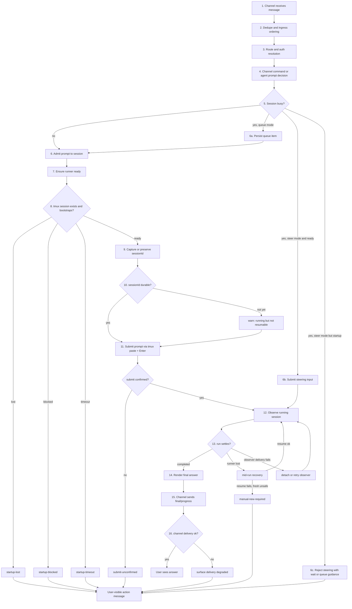

# Channel To Runner Stability Failure Map

## Status

Research artifact.

This is not a stable architecture contract yet. Use it to find the highest-risk
failure boundaries, choose simplification work, and turn repeated operator pain
into targeted backlog.

## Purpose

Map the full path from a user message on Slack, Telegram, Zalo, or API surfaces
down to the native CLI runner and back to the channel.

Interactive HTML artifact:

- [Channel To Runner Stability Map](../../artifacts/2026-06-09-channel-to-runner-stability-map/index.html)

The goal is to answer:

- where messages most often fail or become ambiguous
- which states need clearer classification
- which failures can be recovered automatically
- which failures require user action or admin action
- which operator signals are missing when a user has to resend messages

## End-To-End Flow



## State Model For The Message Path

| Step | Owner | State | Healthy Signal | Failure Signal | Current User Impact |
| --- | --- | --- | --- | --- | --- |
| Channel receive | `channels` | `received` | provider event accepted | duplicate, malformed, unrouted, unauthorized | no reply or onboarding/error |
| Ingress ordering | `channels/message` | `admitted-to-channel` | one processing path per provider event | duplicate replay, media group race, late event | duplicate or missing response |
| Route and auth | `channels`, `auth`, `config` | `routed` | agent, route, sender, permissions resolved | no route, pairing required, permission denied | user may not know who can fix |
| Prompt decision | `channels/message` | `agent-prompt` or `command` | slash/control command handled or prompt built | native slash conflict, command disabled, attachment issue | unexpected CLI command behavior |
| Session admission | `agents/session` | `prompt-admitted` | stored `lastAdmittedPromptAt`, active run record | active run conflict, stale runtime projection | message queued, rejected, or appears stuck |
| Runner startup | `agents/runtime`, `runners/tmux` | `starting` | tmux session exists, bootstrap reaches ready | session lost, blocked prompt, timeout | user must resend or wait without cause |
| Session identity | `agents/session`, `runners` | `sessionId-captured` | active `sessionId` persisted | missing, stale, native resume id not found | session runs but cannot resume safely |
| Prompt submit | `runners/tmux` | `submitted` | paste visible, Enter changes pane state | paste or submit unconfirmed | prompt not run, user has to resend |
| Run observation | `agents/session` | `running` | monitor sees meaningful updates and final settle | runner lost, detached, stale active run | repeated "still running" or abrupt failure |
| Recovery | `agents/session`, `agents/runtime` | `recovering` | same session resumes or clear fallback | resume fails, fresh replay unsafe | `/new` required but root cause unclear |
| Channel rendering | `channels/message` | `delivering` | progress/final sent to same surface | provider send/edit failure | runner may finish but user sees nothing |
| Operator visibility | `control` | `diagnosable` | status, logs, watch, sessionId, artifact path | error text lacks class/action/root cause | admin cannot triage quickly |

## Error Class Map

| Error Seen By User Or Logs | Failure Boundary | Likely Root Cause Classes | Current Recovery Posture | Better Product Behavior |
| --- | --- | --- | --- | --- |
| `Runner session "<name>" disappeared during startup.` | runner startup | tmux session exited, CLI self-update/restart, binary/path failure, startup blocker caused exit, cleanup killed session | fail startup | classify as `startup-lost`; include last pane, exit record, `runner inspect/watch` command, and whether retry is safe |
| `The previous runner session could not be resumed... Use /new...` | mid-run or next-run recovery | stored `sessionId` rejected by native CLI, native session expired, tmux host lost, workspace changed, CLI profile changed | preserve stored id and require manual `/new` | include resume command attempted, native error, session age, workspace, and safe next action button/text |
| `TmuxSubmitUnconfirmedError... pane state did not change...` | tmux submit | prompt was pasted but Enter did not submit, CLI input not focused, prompt box blocked, terminal alternate mode, timing too short | fail truthfully | auto-probe focus/blocker, retry boundedly with richer confirmation, show `paste-visible` vs `enter-no-effect` |
| `did not reach the configured ready state within 60000ms... No saved session found with ID...` | startup resume readiness | stored `sessionId` points to a native session Codex cannot resume, resume command failed before prompt box | timeout with last pane | classify as `resume-session-id-not-found`, not generic ready timeout; recommend `/new` or automatic quarantine |
| `could not capture a durable session id yet... not resumable...` | session identity capture | status command failed, capture pattern drift, CLI delayed session id, startup probe not settled, prompt submitted before capture | warning while continuing | create `sessionIdCapture: pending/failed` telemetry; retry in background and surface when persisted |
| user sends multiple times because no answer appears | cross-cutting UX | queue/steer ambiguity, final delivery failure, observer detached, runner completed but channel send failed | mixed | every accepted message needs a visible lifecycle receipt with `queued/running/recovering/failed` and an action |
| user cannot tell whether admin is needed | control UX | error lacks owner, permission boundary, provider setup hint, or command next step | mixed | every failure should include `owner: user/admin/clisbot`, `rootCauseClass`, `nextAction`, and `diagnosticId` |

## Hotspot Heatmap

| Boundary | Current Complexity | Stability Risk | Why It Is Hot | Simplification Direction |
| --- | --- | --- | --- | --- |
| Startup readiness | High | Very high | startup mixes tmux existence, native CLI auth/trust/update screens, ready detection, resume errors | one explicit startup classifier before prompt submit |
| Session id continuity | High | Very high | `sessionKey`, stored `sessionId`, native resume, and runner instance can drift | quarantine bad stored session ids; expose continuity state explicitly |
| tmux paste and submit | Medium | High | truthful submit depends on pane diff and timing | separate paste confirmation, focus/blocker probe, submit confirmation result |
| Mid-run recovery | High | High | safe replay is hard when context may be lost | make recovery outcome and replay policy first-class |
| Channel delivery | Medium | Medium-high | user can miss final answer even if runner succeeded | store delivery status per interaction and expose retry/detached status |
| Operator diagnostics | Medium | High | admin sees raw text but not classified root cause | attach a diagnostic envelope to every user-visible runtime error |
| Queue versus steer | Medium | Medium | repeated user messages can be interpreted differently by route config | show accepted mode and queue position or steering rejection clearly |

## Recommended Diagnostic Envelope

Every user-visible runtime failure should be renderable from a structured
diagnostic object instead of a free-form string.

```json
{
  "diagnosticId": "diag_2026-06-09T10-31-22Z_default_slack_1781001263",
  "phase": "runner_startup",
  "state": "startup-lost",
  "rootCauseClass": "tmux-session-disappeared",
  "owner": "clisbot",
  "userAction": "wait_or_resend_after_recovery",
  "adminAction": "clisbot runner inspect --latest --lines 120",
  "safeAutoRecovery": "retry_startup_once",
  "session": {
    "agentId": "default",
    "sessionKey": "slack:default:C011RKPQ2R3:1781001263.071379",
    "sessionName": "agent-default-slack-channel-c011rkpq2r3-thread-1781001263-071379-d881e622",
    "storedSessionId": "019e8b71-11aa-79b0-829b-7d149276afb1",
    "sessionIdPersistence": "persisted"
  },
  "evidence": {
    "lastPaneSnapshotPath": "~/.clisbot/artifacts/runs/<id>/last-pane.txt",
    "runnerExitRecordPath": "~/.clisbot/state/runner-exits/<session>.json",
    "transitionTimelinePath": "~/.clisbot/artifacts/runs/<id>/transitions.json"
  }
}
```

## Suggested User-Facing Error Shape

Current raw errors tell the truth, but they do not consistently answer what to
do next.

Recommended compact format:

```text
clisbot could not start the runner for this message.

State: startup-lost
Likely cause: the tmux runner exited before the CLI became ready.
What clisbot did: stopped before submitting your prompt, so your prompt was not lost inside the CLI.
You can do now: resend after recovery, or send /new if you want a fresh conversation.
Admin details: run `clisbot runner inspect --latest --lines 120` and check diagnostic diag_...
```

For resume id failures:

```text
clisbot could not resume the previous CLI conversation.

State: resume-session-id-not-found
Likely cause: the native CLI no longer has stored session id 019e...
What clisbot did: preserved the stored id and did not silently open a new conversation.
You can do now: send /new, then resend the full prompt.
Admin details: inspect diagnostic diag_... and decide whether to quarantine this stored session id.
```

## Reliability Improvement Backlog

### P0: classify startup before broad recovery

Add a startup classifier with stable states:

- `starting`
- `ready`
- `blocked:update`
- `blocked:trust-workspace`
- `blocked:hook-review`
- `blocked:human-approval`
- `blocked:auth`
- `resume-session-id-not-found`
- `startup-lost`
- `failed:timeout`
- `unknown`

This reduces generic "did not reach ready state" failures and prevents user
prompts from entering a runner that is not truly ready.

### P0: add per-interaction timeline artifacts

For every accepted user message, persist a small timeline:

- `received`
- `routed`
- `prompt-admitted`
- `runner-starting`
- `runner-ready`
- `session-id-capture-pending|captured|failed`
- `paste-confirmed`
- `submit-confirmed`
- `running`
- `recovering`
- `completed`
- `channel-delivered`
- `failed`

This is the fastest way to find whether most pain sits in channels, sessions,
runner startup, submit, recovery, or final delivery.

### P0: quarantine invalid stored session ids

When native CLI says a stored session id does not exist, do not keep treating it
as an ordinary ready timeout.

Recommended behavior:

- mark the stored id as `resumeRejected`
- preserve it for diagnostics
- stop automatic reuse until `/resume <id>` or explicit admin action
- tell the user `/new` is the safe next action

### P1: make submit confirmation more explainable

Split `TmuxSubmitUnconfirmedError` into a richer result:

- `paste-not-visible`
- `paste-visible-enter-no-effect`
- `input-focused-false`
- `blocked-by-prompt`
- `pane-lost-during-submit`
- `submit-confirmed`

That lets clisbot decide whether to retry, recover, or ask for admin action.

### P1: user-visible lifecycle receipts

Every message that clisbot accepts should get a short lifecycle receipt when it
cannot answer quickly:

- `queued`
- `starting runner`
- `recovering previous runner`
- `waiting for CLI approval`
- `failed before submitting prompt`
- `completed but final delivery failed`

This lowers the "I keep sending again because nothing happened" loop.

### P1: diagnostic IDs in channel messages

Attach a diagnostic id to runtime failures shown in chat and make control
commands able to search by it.

Operator target:

```text
clisbot diagnostics get <diagnostic-id>
```

Until that command exists, include concrete fallback commands:

- `clisbot status`
- `clisbot runner list`
- `clisbot runner inspect --latest --lines 120`
- `clisbot logs --lines 200`

## Questions To Answer With Telemetry

Track counts by `phase` and `rootCauseClass` for a week of real use:

- How many accepted messages fail before prompt submission?
- How many fail after prompt submission?
- How many failures are resume/session-id drift?
- How often does `sessionIdCapture` remain pending after startup?
- How many user repeats happen while an earlier prompt is queued or running?
- How many completed runs fail only at channel delivery?
- Which channel has the highest observer delivery failure rate?
- Which CLI has the highest startup blocker rate?

The answer should directly drive simplification:

- high startup failures: invest in startup classifier and CLI-specific blockers
- high submit failures: improve tmux confirmation and focus detection
- high resume failures: quarantine invalid session ids and simplify `/new`
- high channel delivery failures: persist delivery status and retry final send
- high repeat-message rate: improve lifecycle receipts and queue/steer UX

## Implemented 2026-06-10

The highest-risk gates from this map were tightened in code. The shipped state
model for one prompt is now:

`received -> routed -> prompt-admitted -> runner-starting -> (resume-rejected? fresh-fallback) -> runner-ready -> pasted(confirmed) -> enter-sent -> submit-settled(composer drained) -> running -> settled -> delivered`

Gate changes:

- startup resume gate: `waitForTmuxSessionBootstrap` classifies
  `resume-rejected` from runner output (for example Codex
  `No saved session found with ID ...`) on the first poll instead of burning
  the full ready timeout. On a normal prompt startup clisbot then clears the
  dead stored id, opens a fresh conversation, runs the prompt there, and posts
  a note containing the old session id and the manual resume command. The
  preserved-id + `/new` posture remains only for ambiguous failures and for
  mid-run reopen, where silently dropping in-progress context would be wrong.
- resume launches that keep exiting nonzero fall back to a fresh conversation
  after the preserved-session-id retries, instead of failing with a manual
  `/new` instruction.
- submit gate: "pane changed after Enter" is no longer treated as submission
  truth. `submitTmuxSessionInput` now settles into
  `submitted | pending-input | unchanged`; `pending-input` (prompt text still
  sitting in the composer because Enter landed as a newline or was swallowed)
  is healed by bounded automatic re-Enter, which removes the manual `/nudge`
  workaround for that drift.
- session identity gate: when startup capture misses, clisbot retries the
  capture right after the run settles (idle pane), so the conversation becomes
  resumable instead of staying permanently uncaptured.
- remaining user-visible failures (`startup-lost`, ready timeout, submit
  unconfirmed, missing session id) now name the exit code where known, state
  whether the prompt was submitted, and give the concrete next action plus the
  operator command to inspect.

## Implemented 2026-06-11: shared CODEX_HOME contention

Multi-agent hosts sharing one `CODEX_HOME` hit codex's known sqlite contention
(no SQLITE_BUSY retry on some write paths, openai/codex#20213): a `codex
resume` exits nonzero while another codex process holds `state_5.sqlite` /
`logs_2.sqlite`, even though the saved rollout still exists.

- the wrapper now prints `[clisbot] runner exited with status N` and keeps the
  pane alive for 8s after a nonzero exit, so clisbot reads the runner's real
  error output instead of only seeing a vanished tmux session
  (`src/control/runner/runner-exit-diagnostics.ts`)
- bootstrap classifies that lingering pane (`status: "exited"`), and
  `src/runners/runner-state-failures.ts` maps it to: state-db contention
  (transient: retry with the preserved session id and backoff, never a fresh
  conversation), state-db corruption/migration mismatch (permanent: actionable
  operator error, no useless retries), or the existing recoverable-loss flow
  with pane evidence
- the session-reuse path skips and clears lingering post-exit panes so a new
  prompt can never be submitted into a dead runner's pane
- root fix tracked separately: per-agent runner env / CODEX_HOME isolation
  (`docs/tasks/features/runners/2026-06-11-per-agent-codex-home-isolation.md`)

## Source Anchors

- Runtime ownership: `docs/architecture/runtime-architecture.md`
- Surface ownership: `docs/architecture/surface-architecture.md`
- Stability feature area: `docs/features/non-functionals/stability/README.md`
- Codex runner stability plan: `docs/tasks/features/stability/2026-06-05-codex-runner-stability-strategy.md`
- Active run and observer lifecycle: `src/agents/session/session-service.ts`
- Runner startup and resume handling: `src/agents/runtime/runner-service.ts`
- tmux paste and submit confirmation: `src/runners/tmux/session-handshake.ts`
